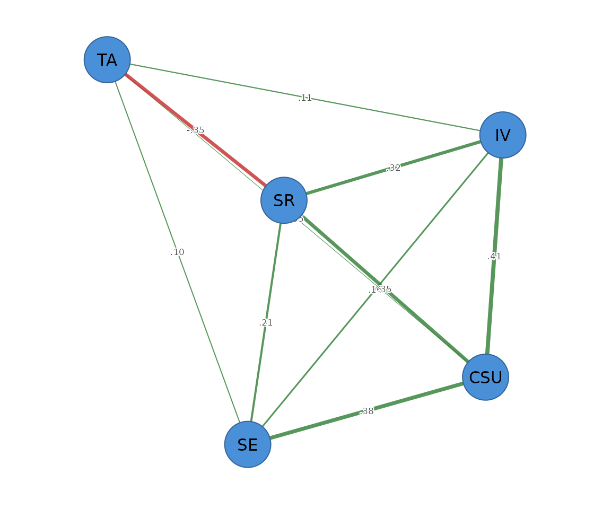

# Gaussian graphical models

``` r

library(psychnets)
```

## What is a psychological network?

Network analysis lets researchers chart relations, map connections, and
discover clusters among interacting components, and it has become a
central method for understanding complex systems. Its early successes
were with social networks — people linked by who talks to whom. To go
beyond who-interacts-with-whom and reason about variables and their
associations, we need a different, *probabilistic* kind of network.

In a probabilistic, or **psychological**, network the **nodes** are
variables — constructs, behaviours, attitudes, or scale scores — and the
**edges** are the probabilistic associations between them (Saqr, Beck &
López-Pernas, 2024; Borsboom et al., 2021). This vignette focuses on the
most widely used such model, the **Gaussian graphical model (GGM)**, a
network whose edges are *partial correlations*.

A partial correlation measures the association between two variables
*after controlling for every other variable in the network* — their
conditional dependence, *ceteris paribus*. Suppose we study five
learning constructs: motivation, achievement, engagement,
self-regulation, and well-being. An edge between well-being and
achievement then means the two are associated *beyond* what their shared
relations with motivation, engagement, and self-regulation already
explain. Equally informative is what is *missing*: when there is no edge
between two variables, they are conditionally independent given the
rest. So both the presence **and** the absence of an edge are
interpretable and meaningful — a property that sets these networks apart
from a plain table of correlations (Epskamp & Fried, 2018; Epskamp,
Waldorp, Mõttus & Borsboom, 2018).

In practice many of the small partial correlations in a network are just
noise. Regularization removes those negligible edges — shrinking them to
exactly zero — leaving a sparse network that is easier to read and more
likely to replicate. Beyond estimating the edges, psychological-network
methods also supply tools to judge how *trustworthy* a network is:
bootstrapping the accuracy of edge weights and centralities, and gauging
how well a network is expected to replicate (Epskamp, Borsboom & Fried,
2018).

## Why regularize?

If we simply invert the sample correlation matrix, every pair of
variables gets a non-zero partial correlation: the resulting network is
fully connected, and many of those edges are non-zero only by sampling
chance. Such a dense graph is hard to interpret and unstable, especially
when the number of variables is large relative to the sample size — the
usual situation in psychological data.

The **graphical lasso** fixes this. It applies a penalty that shrinks
small partial correlations all the way to zero, so that only the edges
with real support in the data survive. How hard to shrink is itself
chosen from the data, by the extended Bayesian information criterion
(**EBIC**), which trades off model fit against the number of edges. The
result is a sparse, interpretable network. (The exact penalty and
selection criterion are given in *Mathematical foundations* at the end
of this vignette.)

## A worked example

The illustrations use `SRL_GPT`, one of five data sets that ship with
the package. Each is a sample of 300 cases of Motivated Strategies for
Learning Questionnaire (MSLQ) construct scores, generated by a large
language model in a study of self-regulated learning simulated through
LLM-generated survey responses. The five constructs are cognitive
strategy use (`CSU`), intrinsic value (`IV`), self-efficacy (`SE`),
self-regulation (`SR`), and test anxiety (`TA`); each score is the mean
of that construct’s Likert items on the 1–7 scale.

``` r

head(SRL_GPT)
#>        CSU       IV       SE       SR   TA
#> 1 5.307692 5.666667 5.777778 5.333333 4.00
#> 2 5.846154 6.444444 6.000000 5.777778 4.00
#> 3 6.615385 6.666667 6.222222 6.333333 3.25
#> 4 5.692308 6.555556 6.333333 5.555556 4.50
#> 5 4.384615 5.555556 4.888889 4.777778 4.00
#> 6 4.846154 5.444444 5.666667 5.111111 3.50
```

### Estimating the network

[`psychnet()`](https://pak.dynasite.org/psychnets/reference/psychnet.md)
is deliberately simple to use: in the common case you supply only two
arguments — the `data` and the `method`. Here `method = "glasso"` fits
the EBIC-regularized graphical lasso. Everything else has a sensible
default, so a complete analysis is a single readable call; the remaining
arguments (covered under *A note on options* and *Mathematical
foundations*) are there only when you want fine-grained control. (Coming
from `qgraph`/`bootnet`? The spelling `"EBICglasso"` is accepted as an
alias for `"glasso"`.)

``` r

net <- psychnet(SRL_GPT, method = "glasso")
net
#> <psychnet> glasso network
#>   nodes: 5   edges: 10   (undirected)
#>   lambda: 0.00861   gamma: 0.5
#>   optimality (KKT residual): 2.21e-10
```

The fitted partial-correlation network is the tidy edge list returned by
[`as.data.frame()`](https://rdrr.io/r/base/as.data.frame.html):

``` r

as.data.frame(net)
#>    from to      weight
#> 1   CSU IV  0.41166866
#> 2   CSU SE  0.38290223
#> 3    IV SE  0.15992605
#> 4   CSU SR  0.35481359
#> 5    IV SR  0.31909443
#> 6    SE SR  0.20767208
#> 7   CSU TA  0.04906668
#> 8    IV TA  0.11058735
#> 9    SE TA  0.09871818
#> 10   SR TA -0.34985157
```

Each weight is the estimated partial correlation between two constructs,
after conditioning on the other three. The structure is readable: `CSU`,
`IV`, `SE`, and `SR` form a positively connected cluster, while test
anxiety (`TA`) is negatively tied to self-regulation (`SR`) — more
anxiety goes with less self-regulation, over and above everything else
in the network.

### Centrality

Centrality summarizes how important each node is. **Node strength** is
the sum of the absolute edge weights at a node — how strongly it is
connected overall. **Expected influence** is the *signed* sum, which
keeps the direction of the edges, so a node with strong negative
connections can have low or negative influence even when its strength is
high.

``` r

net_centralities(net)
#>   node  strength expected_influence
#> 1  CSU 1.1984512         1.19845117
#> 2   IV 1.0012765         1.00127649
#> 3   SE 0.8492185         0.84921854
#> 4   SR 1.2314317         0.53172852
#> 5   TA 0.6082238        -0.09147935
```

`SR` and `CSU` are the most strongly connected constructs; `TA`, with
its single strong negative edge, has the lowest expected influence.

### Predictability

Predictability asks a complementary question: how much of each node’s
variance is explained by its neighbours in the network (Haslbeck &
Waldorp, 2018)? It tells us whether the connections around a node are
actually informative about it.

``` r

net_predict(net)
#>   node     type metric predictability accuracy
#> 1  CSU gaussian     R2      0.8217840       NA
#> 2   IV gaussian     R2      0.7690346       NA
#> 3   SE gaussian     R2      0.7142811       NA
#> 4   SR gaussian     R2      0.7786477       NA
#> 5   TA gaussian     R2      0.1421163       NA
```

Most constructs are highly predictable from their neighbours (variance
explained above 0.7), whereas test anxiety (`TA`) is comparatively
isolated (about 0.14), consistent with its single strong edge.

### Plotting

Passing the fitted object to
[`cograph::splot()`](https://sonsoles.me/cograph/reference/splot.html)
with `psych_styling = TRUE` draws the network with a spring layout,
labelled nodes, and the conventional colour coding (green for positive
edges, red for negative). For a graphical-lasso network the object
already carries each node’s predictability, and the plot draws it
automatically as a ring around the node — the visual analogue of the
[`net_predict()`](https://pak.dynasite.org/psychnets/reference/net_predict.md)
table above.

``` r

cograph::splot(net, psych_styling = TRUE)
```



### A note on options

The defaults above (Pearson correlations, pairwise-complete handling of
missing data) match the common bootnet workflow, but several options are
worth knowing. For Likert data, `cor_method = "auto"` switches to the
polychoric/polyserial correlation used by `qgraph` and `bootnet`. For
speed, `native = FALSE` dispatches the inner solve to the optional
Fortran `glasso` package. The full list of arguments and their defaults
is tabulated in *Mathematical foundations*, below.

### A second example: how the options change the network

The two-argument call above uses every default. Because the substantive
choices are just arguments, we can change one and watch its effect. Here
we re-estimate the network from rank-based (Spearman) correlations and a
lighter EBIC penalty (`gamma = 0.25` rather than `0.5`):

``` r

net2 <- psychnet(SRL_GPT, method = "glasso", cor_method = "spearman", gamma = 0.25)
as.data.frame(net2)
#>   from to      weight
#> 1  CSU IV  0.41037571
#> 2  CSU SE  0.42434529
#> 3   IV SE  0.12821527
#> 4  CSU SR  0.32164519
#> 5   IV SR  0.34602908
#> 6   SE SR  0.18400655
#> 7   IV TA  0.07280225
#> 8   SE TA  0.07509761
#> 9   SR TA -0.23654039
```

Comparing this with the default Pearson fit shows the difference
concretely: the default keeps all ten edges, including the very weak
`CSU`–`TA` link (about 0.05), whereas this fit drops it and returns
nine. The strong `CSU`/`IV`/`SE`/`SR` cluster and the negative `SR`–`TA`
edge survive either way; what changes is which *borderline* edges are
retained. The correlation type and the penalty therefore decide the fate
of weak edges, even when the backbone is stable.

A second, more direct control is `threshold`, a post-hoc absolute-weight
floor that simply removes any edge smaller than a chosen size. With
`threshold = 0.1` the three weak `TA` edges fall away and only the eight
strongest remain:

``` r

as.data.frame(psychnet(SRL_GPT, method = "glasso", threshold = 0.1))
#>   from to     weight
#> 1  CSU IV  0.4116687
#> 2  CSU SE  0.3829022
#> 3   IV SE  0.1599260
#> 4  CSU SR  0.3548136
#> 5   IV SR  0.3190944
#> 6   SE SR  0.2076721
#> 7   IV TA  0.1105874
#> 8   SR TA -0.3498516
```

## Non-normal data

Construct scores are continuous but usually skewed and bounded rather
than exactly Gaussian. When joint normality is doubtful, the
**nonparanormal** model relaxes it: it assumes the variables are jointly
Gaussian only after unknown monotone transformations of each variable,
estimates those transformations from the ranks, and then applies the
identical EBIC graphical lasso. This is `method = "huge"`, and it
certifies against the same optimality conditions:

``` r

certificate(psychnet(SRL_GPT, method = "huge"))
#>   method  certificate kind certified
#> 1   huge 2.471425e-10  kkt      TRUE
```

------------------------------------------------------------------------

## Mathematical foundations

This section is a technical reference. It states the model, the
estimator, the selection criterion, the implementation, and the
optimality certificate precisely, for readers who want the definitions
and equations behind the tutorial above. It can be skipped on a first
reading.

### The Gaussian graphical model

Let $`\mathbf{X} = (X_1, \dots, X_p)`$ follow a multivariate normal
distribution $`\mathcal{N}(\boldsymbol\mu, \boldsymbol\Sigma)`$ with
covariance matrix $`\boldsymbol\Sigma`$ and precision (concentration)
matrix $`\mathbf{K} = \boldsymbol\Sigma^{-1}`$. The GGM encodes the
conditional independence structure of $`\mathbf{X}`$ in an undirected
graph on the $`p`$ variables. Its defining property is the pairwise
Markov property: a zero in the precision matrix is exactly a conditional
independence,

``` math
K_{ij} = 0 \;\Longleftrightarrow\; X_i \perp\!\!\!\perp X_j \mid \mathbf{X}_{\setminus\{i,j\}},
```

that is, $`X_i`$ and $`X_j`$ are independent given all remaining
variables (Lauritzen, 1996). The off-diagonal entries of $`\mathbf{K}`$
are in one-to-one correspondence with the partial correlations,

``` math
\rho_{ij \cdot \text{rest}} \;=\; \frac{-K_{ij}}{\sqrt{K_{ii} K_{jj}}},
```

so an edge in a GGM is a non-zero partial correlation between two
variables after conditioning on every other variable in the system. In
the psychometric network literature this object is the central model:
nodes are measured variables and edges are conditional
(partial-correlation) associations (Epskamp & Fried, 2018).

### The graphical lasso objective

The maximum-likelihood estimate of $`\mathbf{K}`$ from a sample
covariance matrix $`\mathbf{S}`$ inverts $`\mathbf{S}`$ directly and is
therefore dense. The graphical lasso (Yuan & Lin, 2007; Banerjee, El
Ghaoui & d’Aspremont, 2008; Friedman, Hastie & Tibshirani, 2008) instead
maximizes an $`\ell_1`$-penalized Gaussian log-likelihood,

``` math
\hat{\mathbf{K}}
 \;=\; \arg\max_{\mathbf{K} \succ 0}
       \Bigl[ \log\det \mathbf{K} - \operatorname{tr}(\mathbf{S}\mathbf{K})
              - \lambda \lVert \mathbf{K} \rVert_1 \Bigr],
```

where $`\lVert \mathbf{K} \rVert_1 = \sum_{i \neq j} |K_{ij}|`$
penalizes the off-diagonal entries and $`\lambda \geq 0`$ is a tuning
parameter. The penalty shrinks small partial correlations exactly to
zero, producing a sparse graph and controlling sampling variability when
$`p`$ is large relative to $`n`$. The objective is strictly concave in
$`\mathbf{K}`$, so its maximizer is unique.

### Tuning by the extended BIC

The penalty $`\lambda`$ is selected over a path of candidate values by
minimizing the extended Bayesian information criterion (EBIC; Foygel &
Drton, 2010), which augments the ordinary BIC with a term that penalizes
the size of the model space:

``` math
\mathrm{EBIC}_\gamma
 \;=\; -2\,\ell(\hat{\mathbf{K}}) + E \log n + 4\,E\,\gamma \log p,
```

where $`\ell`$ is the maximized Gaussian log-likelihood, $`E`$ is the
number of non-zero edges, and $`\gamma \in [0, 1]`$ is a hyperparameter
(the `gamma` argument, default $`0.5`$) governing the strength of the
model-space penalty. Setting $`\gamma = 0`$ recovers ordinary BIC;
larger $`\gamma`$ favours sparser graphs. The candidate path is
logarithmically spaced between the smallest penalty that yields the
empty graph and a fraction `lambda_min_ratio` of it, with `nlambda`
points. In `psychnets` the defaults are `nlambda = 100` and
`lambda_min_ratio = 0.01`.

### The psychnets implementation

The estimator is a clean-room reimplementation in pure base R. The
package imports only the base packages `stats` and `parallel`; it does
not depend on `glasso`, `qgraph`, `glmnet`, or `Matrix`, and contains no
compiled code. The solver is the covariance block-coordinate-descent
algorithm of Friedman, Hastie & Tibshirani (2008). Writing
$`\mathbf{W} = \mathbf{K}^{-1}`$ for the model covariance, the algorithm
cycles over the columns of $`\mathbf{W}`$; for each column the
off-diagonal block is updated by solving an ordinary lasso regression
via coordinate descent (with the diagonal held fixed at the diagonal of
$`\mathbf{S}`$, since the penalty is off-diagonal only), and the
precision matrix is reconstructed from the converged $`\mathbf{W}`$ and
the lasso coefficients.

Selection of $`\lambda`$ proceeds in two tiers. The EBIC criterion only
needs to identify which edges are active at each candidate $`\lambda`$,
and the lasso zeros inactive edges exactly, so the path is first scanned
at a loose convergence tolerance (`scan_tol = 1e-4`). The single
$`\lambda`$ that minimizes EBIC is then refit at a tight tolerance
(`refit_tol = 1e-8`), so the returned estimate is the converged optimum
of the convex objective rather than a coarse path point.

### The KKT optimality certificate

Because the graphical-lasso objective is strictly convex, its optimum is
unique and is characterized exactly by the first-order
(Karush–Kuhn–Tucker) stationarity conditions. Writing
$`\mathbf{W} = \hat{\mathbf{K}}^{-1}`$, the optimal estimate satisfies

``` math
W_{ii} = S_{ii}, \qquad
W_{ij} - S_{ij} = \lambda\,\operatorname{sign}(K_{ij})
 \;\text{ where } K_{ij} \neq 0, \qquad
|W_{ij} - S_{ij}| \leq \lambda \;\text{ otherwise.}
```

The
[`certificate()`](https://pak.dynasite.org/psychnets/reference/certificate.md)
verb returns the maximum absolute violation of these conditions as a
tidy one-row data frame:

``` r

certificate(net)
#>   method  certificate kind certified
#> 1 glasso 2.213401e-10  kkt      TRUE
```

The residual is at the order of machine precision. Because the minimizer
is unique, a residual this small confirms that the reported precision
matrix satisfies the first-order optimality conditions of the penalized
objective to numerical precision. This is a reproducibility and
verification diagnostic — a numerical-analysis check that the solver
converged — rather than a substantive property of the data; the `kind`
column records that it is a KKT residual and `certified` flags whether
it falls below the tolerance `tol` (default $`10^{-6}`$).

### The solver engine

The `native` argument selects the inner fixed-penalty solver. The
default, `native = TRUE`, is psychnets’ own pure-R
block-coordinate-descent solver described above. Setting
`native = FALSE` (which requires the optional Fortran `glasso` package,
listed under `Suggests`) dispatches each fixed-penalty solve to that
established package instead, producing numerically equivalent graph
structure at Fortran speed; the optimality residual then reflects the
`glasso` package’s own convergence tolerance rather than the tighter
base-R refit.

### Argument reference

Only `data` and `method` are required; everything else has a default.
The full set of arguments for the graphical lasso is:

| Argument | Default | Meaning |
|----|----|----|
| `data` | — | Numeric $`n \times p`$ matrix or data frame (rows are observations). |
| `cor_matrix`, `n` | `NULL` | A precomputed $`p \times p`$ correlation matrix and its sample size, used in place of `data`. |
| `cor_method` | `"pearson"` | Correlation estimator: `"pearson"`, `"spearman"`, `"kendall"`, or `"auto"` (polychoric/polyserial [`cor_auto()`](https://pak.dynasite.org/psychnets/reference/cor_auto.md), for ordinal data). |
| `gamma` | `0.5` | EBIC hyperparameter $`\gamma`$; larger values give sparser graphs, $`0`$ is ordinary BIC. |
| `nlambda` | `100` | Number of penalties on the $`\lambda`$ path. |
| `lambda_min_ratio` | `0.01` | Smallest $`\lambda`$ as a fraction of the penalty that empties the graph. |
| `threshold` | `0` | Post-hoc absolute-weight floor; edges below it are set to zero. |
| `na_method` | `"pairwise"` | Missing data: `"pairwise"` (pairwise-complete correlations with a nearest-positive-definite projection) or `"listwise"` (complete-case deletion). |
| `native` | `TRUE` | Inner solver: `TRUE` = psychnets’ pure-R solver, `FALSE` = the `glasso` Fortran package. |
| `labels` | `NULL` | Node names. |

Researchers migrating from
[`qgraph::EBICglasso()`](https://rdrr.io/pkg/qgraph/man/EBICglasso.html)
can map these names onto the `qgraph` arguments with the package’s
[`net_crosswalk()`](https://pak.dynasite.org/psychnets/reference/net_crosswalk.md)
helper.

### Predictability in closed form

For a Gaussian graphical model, node predictability is available in
closed form from the precision matrix (Haslbeck & Waldorp, 2018): the
proportion of variance of node $`j`$ explained by the remaining nodes is

``` math
R^2_j \;=\; 1 - \frac{1}{K_{jj}\, S_{jj}},
```

where $`K_{jj}`$ is the diagonal of the precision matrix and $`S_{jj}`$
the corresponding variance.
[`net_predict()`](https://pak.dynasite.org/psychnets/reference/net_predict.md)
reports these per-node values, requiring no access to the raw data.

### The nonparanormal extension

The nonparanormal (Liu, Lafferty & Wasserman, 2009) assumes that the
variables are jointly Gaussian after unknown monotone marginal
transformations. Estimating those transformations by a rank-based
Gaussianization and applying the identical EBIC graphical lasso to the
transformed correlation matrix yields a GGM that is robust to monotone
departures from normality. This is `method = "huge"`, which certifies
against the same KKT conditions as the Gaussian case.

## References

Banerjee, O., El Ghaoui, L., & d’Aspremont, A. (2008). Model selection
through sparse maximum likelihood estimation for multivariate Gaussian
or binary data. *Journal of Machine Learning Research*, 9, 485–516.

Borsboom, D., Deserno, M. K., Rhemtulla, M., Epskamp, S., Fried, E. I.,
McNally, R. J., Robinaugh, D. J., Perugini, M., Dalege, J., Costantini,
G., Isvoranu, A.-M., Wysocki, A. C., van Borkulo, C. D., van Bork, R., &
Waldorp, L. J. (2021). Network analysis of multivariate data in
psychological science. *Nature Reviews Methods Primers*, 1, 1–18.

Epskamp, S., Borsboom, D., & Fried, E. I. (2018). Estimating
psychological networks and their accuracy: A tutorial paper. *Behavior
Research Methods*, 50(1), 195–212.

Epskamp, S., & Fried, E. I. (2018). A tutorial on regularized partial
correlation networks. *Psychological Methods*, 23(4), 617–634.

Epskamp, S., Waldorp, L. J., Mõttus, R., & Borsboom, D. (2018). The
Gaussian graphical model in cross-sectional and time-series data.
*Multivariate Behavioral Research*, 53(4), 453–480.

Foygel, R., & Drton, M. (2010). Extended Bayesian information criteria
for Gaussian graphical models. In *Advances in Neural Information
Processing Systems* (Vol. 23, pp. 604–612).

Friedman, J., Hastie, T., & Tibshirani, R. (2008). Sparse inverse
covariance estimation with the graphical lasso. *Biostatistics*, 9(3),
432–441.

Haslbeck, J. M. B., & Waldorp, L. J. (2018). How well do network models
predict observations? On the importance of predictability in network
models. *Behavior Research Methods*, 50(2), 853–861.

Lauritzen, S. L. (1996). *Graphical Models*. Oxford: Oxford University
Press.

Liu, H., Lafferty, J., & Wasserman, L. (2009). The nonparanormal:
Semiparametric estimation of high dimensional undirected graphs.
*Journal of Machine Learning Research*, 10, 2295–2328.

Saqr, M., Beck, E., & López-Pernas, S. (2024). Psychological networks: A
modern approach to the analysis of learning and complex learning
processes. In M. Saqr & S. López-Pernas (Eds.), *Learning Analytics
Methods and Tutorials: A Practical Guide Using R* (Chapter 19).
Springer.
<https://lamethods.org/book1/chapters/ch19-psychological-networks/ch19-psych.html>

Yuan, M., & Lin, Y. (2007). Model selection and estimation in the
Gaussian graphical model. *Biometrika*, 94(1), 19–35.
