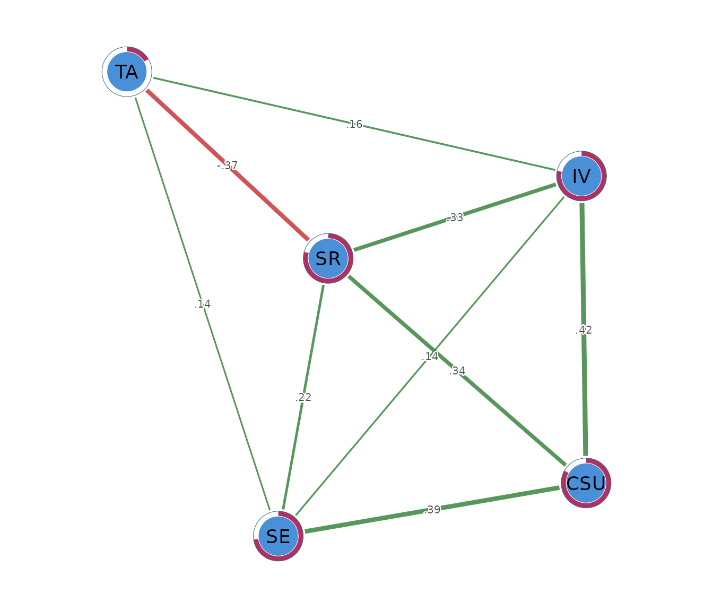

# Stepwise Gaussian graphical model selection

## What stepwise model selection does

A Gaussian graphical model describes which variables remain associated
after the other variables in the network have been taken into account.
Each edge is a partial correlation. Its practical interpretation is an
association above and beyond what the remaining measured variables can
explain.

Consider a network containing motivation, academic achievement, prior
achievement, study effort, self-efficacy, and test anxiety. An edge
between motivation and achievement means that these two variables remain
associated after accounting for the other four. If that edge is absent,
their ordinary correlation may be explained sufficiently by the
variables already included in the model. For example, motivated students
may study more, and study effort may account for much of the observed
motivation-achievement association.

Stepwise model selection decides which of these adjusted associations to
retain. It compares candidate networks and selects the structure that
provides the best balance between fit and complexity. The retained
network focuses interpretation on relations that contribute enough
unique information to justify an edge.

The method then estimates the retained edge weights without shrinkage.
This feature is useful when the research goal is to obtain partial
correlations for a selected graph. The structure is chosen through model
comparison, and the final weights are maximum-likelihood estimates under
that structure.

## The data

The worked example uses `SRL_GPT`, which contains 300 observations on
five self-regulated learning constructs. Cognitive strategy use (`CSU`),
intrinsic value (`IV`), self-efficacy (`SE`), self-regulation (`SR`),
and test anxiety (`TA`) are composite scores recorded on a 1 to 7 scale.
Rows are observations and columns are network nodes.

``` r

head(SRL_GPT)
#>        CSU       IV       SE       SR   TA
#> 1 5.307692 5.666667 5.777778 5.333333 4.00
#> 2 5.846154 6.444444 6.000000 5.777778 4.00
#> 3 6.615385 6.666667 6.222222 6.333333 3.25
#> 4 5.692308 6.555556 6.333333 5.555556 4.50
#> 5 4.384615 5.555556 4.888889 4.777778 4.00
#> 6 4.846154 5.444444 5.666667 5.111111 3.50
```

The analysis treats these composite scores as continuous. Before
applying the same workflow to another data set, the analyst should
inspect missingness, distributions, unusual observations, and the
measurement scale. The present data are complete, so every pairwise
correlation uses all 300 observations.

## Fitting the network with `psychnet()`

[`psychnet()`](https://pak.dynasite.org/psychnets/reference/psychnet.md)
estimates the stepwise Gaussian graphical model when `method = "ggm"`.
It returns a fitted `psychnet` object containing the selected network
and the quantities needed for subsequent analysis. The default
$`\gamma = 0`$ uses the ordinary Bayesian information criterion, and the
default stepwise search considers single-edge additions and removals.

``` r

stepwise_net <- psychnet(data = SRL_GPT, method = "ggm")
stepwise_net
#> <psychnet> ggm network
#>   nodes: 5   edges: 9   (undirected)
#>   optimality (KKT residual): 6.66e-16
```

The fitted network contains 5 nodes and 9 edges. One of the 10 possible
pairs is removed. The printed KKT residual is $`1.33 \times 10^{-15}`$,
which will be interpreted in the numerical check below.

## Inspecting the selected edges with `summary()`

[`summary()`](https://rdrr.io/r/base/summary.html) prints the fitted
model and returns its edge table invisibly. The table contains `from`,
`to`, and `weight`. Each weight is an unshrunk partial correlation
estimated under the selected network structure.

``` r

summary(stepwise_net)
#> <psychnet> ggm network
#>   nodes: 5   edges: 9   (undirected)
#>   optimality (KKT residual): 6.66e-16
#>   edge weight: range [-0.370, 0.422], mean 0.196
```

The retained weights range from -0.370 to 0.422. The largest positive
edge joins `CSU` and `IV` ($`r = 0.422`$). Cognitive strategy use and
intrinsic value remain positively related above and beyond
self-efficacy, self-regulation, and test anxiety.

The `SR`-`TA` edge is negative ($`r = -0.370`$). Higher self-regulation
is associated with lower test anxiety after the other learning
constructs have been accounted for. The model removes the `CSU`-`TA`
edge. This result means that the selected structure does not retain a
unique conditional association between cognitive strategy use and test
anxiety. It does not imply that their ordinary correlation must be zero.

The `IV`-`TA` and `SE`-`TA` edges are positive but modest, at 0.157 and
0.137. Their magnitudes warrant cautious interpretation. Every edge is
an adjusted association, so the network alone provides no direction of
causation.

## Checking the fitted solution with `certificate()`

[`certificate()`](https://pak.dynasite.org/psychnets/reference/certificate.md)
reports whether the fitted precision matrix satisfies the conditions
that define the maximum-likelihood estimate for the selected graph. It
returns the columns `method`, `certificate`, `kind`, and `certified`.
For this model, `certificate` is the largest numerical discrepancy
across the defining conditions, and `certified` compares that value with
a default tolerance of $`10^{-6}`$.

``` r

certificate(stepwise_net)
#>   method  certificate kind certified
#> 1    ggm 6.661338e-16  kkt      TRUE
```

The residual is $`1.33 \times 10^{-15}`$ and `certified` is `TRUE`. This
value is at the order of machine precision. It indicates that the final
precision matrix satisfies the selected model’s numerical conditions to
numerical precision. The certificate checks computation. It does not
evaluate sampling uncertainty, measurement quality, model assumptions,
or causal interpretation.

## Comparing the selected model with the graphical lasso

[`psychnet()`](https://pak.dynasite.org/psychnets/reference/psychnet.md)
estimates the graphical lasso when `method = "glasso"`. Fitting it to
the same data provides a useful comparison because both methods estimate
partial-correlation networks, but they select and estimate edges
differently.

``` r

glasso_net <- psychnet(data = SRL_GPT, method = "glasso")
glasso_net
#> <psychnet> glasso network
#>   nodes: 5   edges: 10   (undirected)
#>   lambda: 0.00861   gamma: 0.5
#>   optimality (KKT residual): 2.21e-10
```

``` r

summary(glasso_net)
#> <psychnet> glasso network
#>   nodes: 5   edges: 10   (undirected)
#>   lambda: 0.00861   gamma: 0.5
#>   optimality (KKT residual): 2.21e-10
#>   edge weight: range [-0.350, 0.412], mean 0.174
```

The graphical lasso retains all 10 possible edges, including a weak
`CSU`-`TA` edge of 0.049. The stepwise model removes that edge and
retains 9. For shared edges, the stepwise estimates are often slightly
larger in absolute magnitude because its final refit applies no
shrinkage. The `CSU`-`IV` edge is 0.422 in the stepwise model and 0.412
in the graphical lasso. The `SR`-`TA` edge is -0.370 in the stepwise
model and -0.350 in the graphical lasso.

This comparison does not identify a universally preferable model. The
stepwise model reports unshrunk partial correlations for a selected
structure. The graphical lasso estimates all retained weights under an
$`\ell_1`$ penalty. The research aim and the planned approach to
validation should guide the choice.

## Describing node position with `net_centralities()`

[`net_centralities()`](https://pak.dynasite.org/psychnets/reference/net_centralities.md)
computes node-level summaries from the fitted graph. The default output
contains `node`, `strength`, and `expected_influence`. Strength is the
sum of absolute edge weights. Expected influence is the signed sum, so
negative associations offset positive associations.

``` r

net_centralities(stepwise_net)
#>   node  strength expected_influence
#> 1  CSU 1.1523235         1.15232352
#> 2   IV 1.0531117         1.05311170
#> 3   SE 0.8880693         0.88806926
#> 4   SR 1.2592340         0.51929333
#> 5   TA 0.6633854        -0.07655525
```

Self-regulation has the largest strength (1.259), followed by cognitive
strategy use (1.152). Self-regulation has expected influence 0.519
because its negative edge with test anxiety offsets its positive edges
with the learning constructs. Cognitive strategy use has strength and
expected influence of 1.152 because all of its retained edges are
positive.

Test anxiety has the smallest strength (0.663) and a slightly negative
expected influence (-0.077). These values describe its position in the
estimated network. They do not show that self-regulation is an
intervention target or that changing one node would cause changes in its
neighbours.

## Quantifying node predictability with `net_predict()`

[`net_predict()`](https://pak.dynasite.org/psychnets/reference/net_predict.md)
computes how much of each node’s variance is accounted for by the
remaining nodes. For a Gaussian graphical model, it returns a tidy table
with `node`, `type`, `metric`, `predictability`, and `accuracy`.
Continuous nodes use the $`R^2`$ metric, while `accuracy` is `NA`
because classification accuracy does not apply.

``` r

net_predict(stepwise_net)
#>   node     type metric predictability accuracy
#> 1  CSU gaussian     R2      0.8327378       NA
#> 2   IV gaussian     R2      0.7831430       NA
#> 3   SE gaussian     R2      0.7279821       NA
#> 4   SR gaussian     R2      0.7920188       NA
#> 5   TA gaussian     R2      0.1656566       NA
```

Cognitive strategy use has the highest predictability ($`R^2 = 0.833`$).
Intrinsic value ($`R^2 = 0.783`$), self-regulation ($`R^2 = 0.792`$),
and self-efficacy ($`R^2 = 0.728`$) are also strongly accounted for by
the remaining constructs. Test anxiety has the lowest predictability
($`R^2 = 0.166`$), so most of its variance is not accounted for by this
five-node model.

These values describe in-sample explained variance. Out-of-sample
prediction requires a separate validation sample or a resampling design
that evaluates performance on observations excluded from model fitting.

## Visualizing the network with `cograph::splot()`

[`cograph::splot()`](https://sonsoles.me/cograph/reference/splot.html)
draws the fitted network when the optional `cograph` package is
available. Psychological styling uses green for positive edges and red
for negative edges. The predictability ring is requested explicitly for
this model.

``` r

cograph::splot(stepwise_net, psych_styling = TRUE, predictability = TRUE)
```



The figure summarizes the signs and relative magnitudes of the retained
edges. Node placement comes from a layout algorithm and has no
measurement scale. Interpretation should therefore use the printed edge
and node tables as the primary numerical results.

## Sensitivity to rank correlations

[`psychnet()`](https://pak.dynasite.org/psychnets/reference/psychnet.md)
accepts `cor_method = "spearman"` for a rank-based sensitivity analysis.
This analysis asks whether the main structure persists when estimation
depends on monotonic ranks and is less sensitive to extreme values.

``` r

spearman_net <- psychnet(data = SRL_GPT, method = "ggm", cor_method = "spearman")
spearman_net
#> <psychnet> ggm network
#>   nodes: 5   edges: 7   (undirected)
#>   optimality (KKT residual): 1.11e-15
```

``` r

summary(spearman_net)
#> <psychnet> ggm network
#>   nodes: 5   edges: 7   (undirected)
#>   optimality (KKT residual): 1.11e-15
#>   edge weight: range [-0.266, 0.483], mean 0.245
```

The Spearman model contains 7 edges, compared with 9 in the Pearson
model. The positive `CSU`-`IV`, `CSU`-`SE`, `CSU`-`SR`, `IV`-`SR`, and
`SE`-`SR` edges remain, as does the negative `SR`-`TA` edge. The
`IV`-`SE` and `SE`-`TA` edges are removed. The main positive learning
cluster and negative self-regulation to test-anxiety relation persist,
while several weaker connections depend on the correlation estimator.

``` r

certificate(spearman_net)
#>   method  certificate kind certified
#> 1    ggm 1.110223e-15  kkt      TRUE
```

The Spearman fit has a residual of $`1.55 \times 10^{-15}`$ and is
certified. Its numerical solution therefore satisfies the selected
graph’s defining conditions to numerical precision.

## Reporting the analysis

A report should state the variables, sample size, correlation estimator,
missing-data procedure, selection criterion, value of $`\gamma`$, and
whether the stepwise refinement was used. The edge table should be
reported numerically. Interpretation should distinguish partial
correlations from ordinary correlations and from causal effects.

The present analysis used Pearson correlations, ordinary BIC
($`\gamma = 0`$), and the default single-edge stepwise refinement on 300
complete observations. The selected network contained 9 edges. The
largest positive edge was `CSU`-`IV` ($`r = 0.422`$), and the negative
`SR`-`TA` edge was -0.370. The maximum-likelihood refit had a KKT
residual of $`1.33 \times 10^{-15}`$. A Spearman sensitivity model
retained the main pattern but selected 7 edges.

## How stepwise selection works

The fitting procedure begins by generating candidate network structures
across a graphical-lasso penalty path. At this stage, the path is a
practical way to produce networks ranging from sparse to dense. Each
distinct edge pattern is a candidate structure.

Every candidate structure is then refitted by unregularized maximum
likelihood. The Bayesian information criterion scores the tradeoff
between fit and the number of edges. The candidate with the smallest
score becomes the starting network for a local stepwise refinement. The
refinement tests single-edge additions and removals, retaining a change
whenever it improves the criterion. It stops when no single-edge change
improves the score.

The resulting graph is a local optimum among the one-edge alternatives
examined by the search. A different correlation estimator or
model-selection setting can lead to a different structure, as the
Spearman analysis showed. The selected network should therefore be
treated as an estimated model whose stability needs evaluation in a full
study.

## Mathematical foundations

This section states the model and selection criterion precisely. It can
be skipped when the practical workflow is the main interest.

### Gaussian graphical model

Let $`\mathbf{X}`$ follow a multivariate normal distribution with
covariance matrix $`\boldsymbol{\Sigma}`$ and precision matrix
$`\mathbf{K} = \boldsymbol{\Sigma}^{-1}`$. For $`i \ne j`$,

``` math
K_{ij} = 0
\quad \Longleftrightarrow \quad
X_i \perp\!\!\!\perp X_j \mid \mathbf{X}_{\setminus\{i,j\}}.
```

The reported partial correlation is

``` math
\rho_{ij \cdot \mathrm{rest}}
= -\frac{K_{ij}}{\sqrt{K_{ii}K_{jj}}}.
```

### Information criterion

For a candidate graph with $`E`$ edges, sample size $`n`$, and $`p`$
nodes, the extended Bayesian information criterion is

``` math
\operatorname{EBIC}_{\gamma}
= -2\ell(\widehat{\mathbf{K}})
+ E\log(n)
+ 4E\gamma\log(p).
```

The default $`\gamma = 0`$ removes the final term and yields ordinary
BIC. The selected graph is the candidate with the smallest criterion
value, followed by the single-edge refinement.

### Constrained maximum-likelihood certificate

Let $`\mathbf{S}`$ be the sample correlation matrix and
$`\mathbf{W} = \widehat{\mathbf{K}}^{-1}`$ be the covariance matrix
implied by the fitted precision matrix. For every retained edge and
every diagonal entry, the constrained optimum satisfies the
corresponding covariance equality between $`\mathbf{W}`$ and
$`\mathbf{S}`$. Precision entries outside the selected graph are zero.
[`certificate()`](https://pak.dynasite.org/psychnets/reference/certificate.md)
reports the maximum absolute violation across these conditions. A value
near machine precision indicates that the constrained fit satisfies them
to numerical precision.

### Predictability

For node $`j`$, the conditional residual variance is $`1/K_{jj}`$. Its
explained variance is

``` math
R_j^2 = 1 - \frac{1}{K_{jj}S_{jj}},
```

where $`S_{jj}`$ is the marginal variance.
[`net_predict()`](https://pak.dynasite.org/psychnets/reference/net_predict.md)
evaluates this identity for each node in the selected Gaussian graphical
model.
