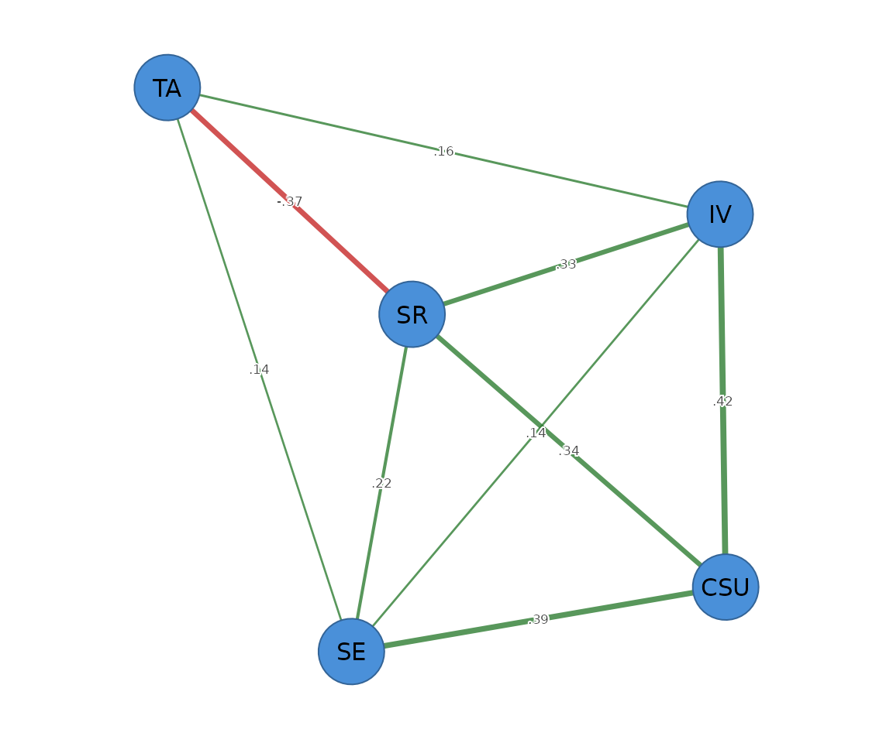

# Stepwise unregularized GGM

``` r

library(psychnets)
```

`method = "ggm"` is a different philosophy from the graphical lasso. The
lasso *shrinks* every edge toward zero; the stepwise GGM uses the lasso
path only to **propose** candidate graphs, then refits the
**unregularized** maximum-likelihood precision on each and picks the
best by extended BIC, refining it with a greedy edge add/drop search.
The retained edges are therefore **not shrunk** – they are the exact
partial correlations for the selected structure. It is equivalent to
[`qgraph::ggmModSelect()`](https://rdrr.io/pkg/qgraph/man/ggmModSelect.html)
(accepted as the alias `"ggmModSelect"`) and self-certified by the
constrained-MLE stationarity residual.

``` r

ms <- psychnet(SRL_GPT, method = "ggm")
ms
#> <psychnet> ggm network
#>   nodes: 5   edges: 9   (undirected)
#>   optimality (KKT residual): 1.22e-15
certificate(ms)
#>   method  certificate kind certified
#> 1    ggm 1.221245e-15  kkt      TRUE
```

## Regularized vs unregularized

Because it does not shrink, the stepwise GGM’s retained edges are larger
in magnitude than the lasso’s on the same data. Compare the two edge
lists:

``` r

as.data.frame(psychnet(SRL_GPT, method = "glasso"))   # shrunk
#>    from to      weight
#> 1   CSU IV  0.41166866
#> 2   CSU SE  0.38290223
#> 3    IV SE  0.15992605
#> 4   CSU SR  0.35481359
#> 5    IV SR  0.31909443
#> 6    SE SR  0.20767208
#> 7   CSU TA  0.04906668
#> 8    IV TA  0.11058735
#> 9    SE TA  0.09871818
#> 10   SR TA -0.34985157
as.data.frame(ms)                                      # unshrunk
#>   from to     weight
#> 1  CSU IV  0.4215770
#> 2  CSU SE  0.3921754
#> 3   IV SE  0.1416604
#> 4  CSU SR  0.3385710
#> 5   IV SR  0.3333520
#> 6   SE SR  0.2173406
#> 7   IV TA  0.1565223
#> 8   SE TA  0.1368928
#> 9   SR TA -0.3699703
```

The default `gamma` is `0` (plain BIC), matching
[`qgraph::ggmModSelect()`](https://rdrr.io/pkg/qgraph/man/ggmModSelect.html)
– the unregularized refit does not need the extra EBIC penalty.

## Predictability

``` r

net_predict(ms)
#>   node     type metric predictability accuracy
#> 1  CSU gaussian     R2      0.8327378       NA
#> 2   IV gaussian     R2      0.7831430       NA
#> 3   SE gaussian     R2      0.7279821       NA
#> 4   SR gaussian     R2      0.7920188       NA
#> 5   TA gaussian     R2      0.1656566       NA
```

## Plotting

Pass the network object to
[`cograph::splot()`](https://sonsoles.me/cograph/reference/splot.html)
with `psych_styling = TRUE` (spring layout, green = positive, red =
negative). For a non-glasso network ask for the predictability ring
explicitly with `predictability = TRUE`.

``` r

cograph::splot(ms, psych_styling = TRUE, predictability = TRUE)
```



See `net_crosswalk("ggmModSelect")` for the argument map against
`qgraph`.
