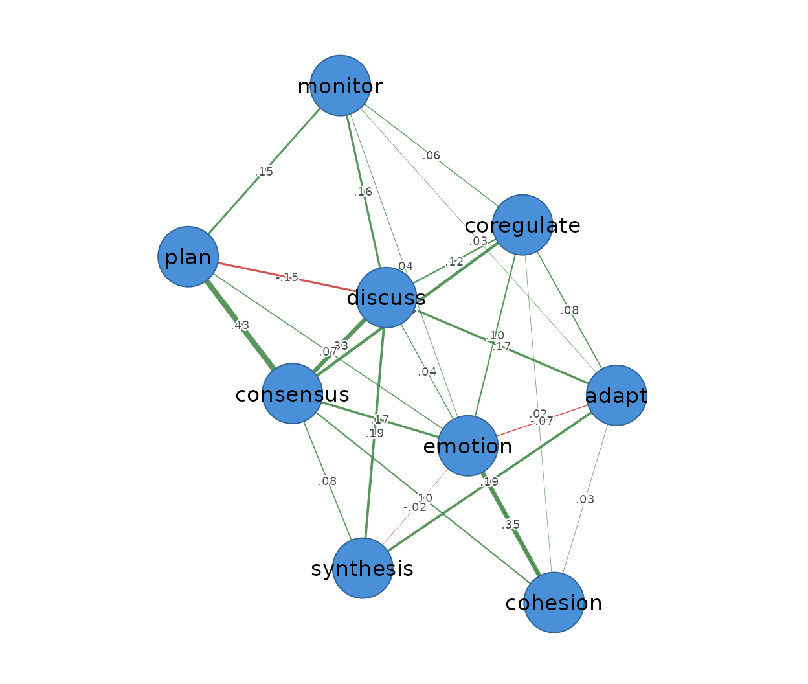
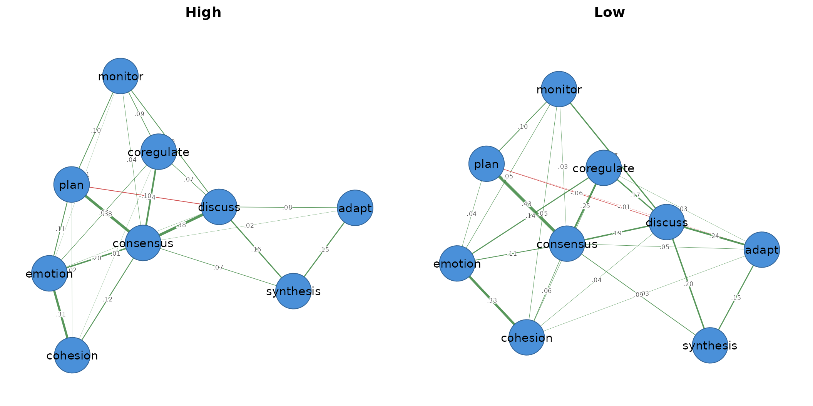
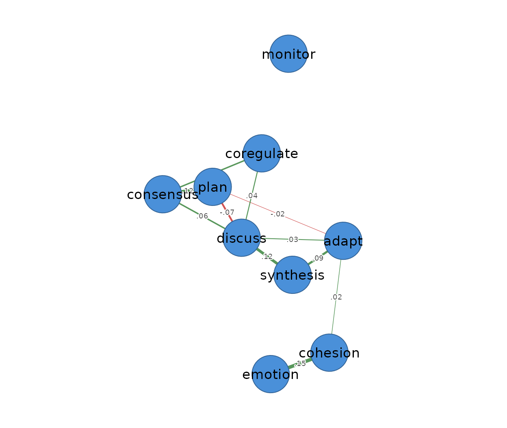
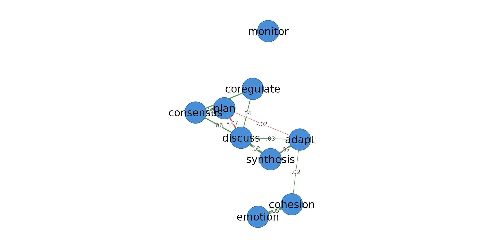
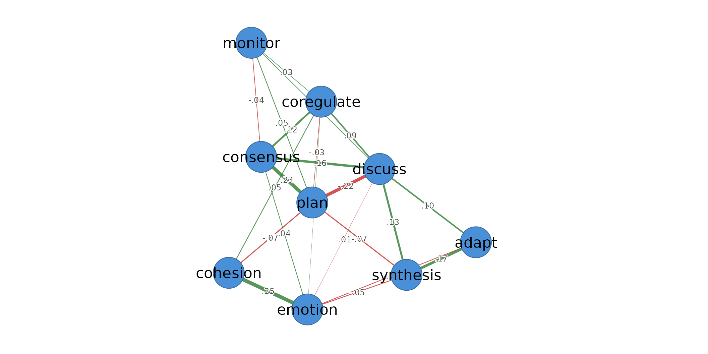

# Regulation networks from event data

## About psychnets

`psychnets` is the psychometric-network engine of **Dynalytics**, a
family of tools for analysing the *process* and *event* data that
learning environments and log files produce. It builds a psychometric
network **directly from an event log** — you do not have to reshape the
log into a wide person-by-item table first. It handles two things for
you:

- **It counts the actions (computes frequencies).** Each unit of
  observation becomes one row, and each action becomes a column holding
  how many times that action occurred. Those counts are the variables
  the network relates.
- **It respects nesting.** When the same person is observed more than
  once, their repeated observations are *nested* inside them.
  `psychnets` keeps the two kinds of variation apart — how states move
  together *within* a person versus how people *differ* on average —
  instead of mixing them into one misleading number.

### The three words you need

- **Action** — the thing that happened (here, a regulation state such as
  *plan* or *monitor*). Actions become the **nodes** of the network.
- **Actor** — *who* did it. Here the actor is the **student** (`Actor`).
- **Occasion** — one row of counts. By default an actor gives **one**
  occasion (all their actions summed). If you split each actor into
  **sessions**, one actor gives **several** occasions — and that is when
  de-clustering matters (below).

This vignette uses the `group_regulation_long` event log from the
**tna** package.

## The data: a regulation event log

Each row is a single **action** by a **student** (`Actor`), at a
**time** (`Time`), in a collaboration **group** (`Group`), with the
student’s achievement level (`Achiever`). This is the raw shape a
learning platform records.

``` r

head(gr)
#>   Actor Achiever Group Course                Time    Action
#> 1     1     High     1      A 2025-01-01 08:27:07  cohesion
#> 2     1     High     1      A 2025-01-01 08:35:20 consensus
#> 3     1     High     1      A 2025-01-01 08:42:18   discuss
#> 4     1     High     1      A 2025-01-01 08:50:00 synthesis
#> 5     1     High     1      A 2025-01-01 08:52:25     adapt
#> 6     1     High     1      A 2025-01-01 08:57:31 consensus
```

## Part 1 — one network from students’ regulation profiles

Give
[`psychnet()`](https://pak.dynasite.org/psychnets/reference/psychnet.md)
the actor column and it does the rest: it counts each **student’s** nine
regulation actions into one profile, then estimates the network of how
those states co-occur across students. The result carries its own
correctness certificate — the tiny KKT residual — so you can trust it is
the optimal network for this data.

``` r

net <- psychnet(gr, actor = "Actor")
net
#> <psychnet> glasso network
#>   nodes: 9   edges: 28   (undirected)
#>   lambda: 0.008001   gamma: 0.5
#>   optimality (KKT residual): 3.19e-11
```

``` r

cograph::splot(net, psych_styling = TRUE)
```



*In plain terms:* every student is summarised by how often they did each
of the nine actions, and the network shows which actions tend to rise
and fall together across students.

## Part 2 — one network per group

Add `group = "Achiever"` and
[`psychnet()`](https://pak.dynasite.org/psychnets/reference/psychnet.md)
estimates a **separate network for each level** — here, high- versus
low-achieving students — and returns them as one object that plots as a
grid and is understood by every analysis verb.

``` r

byach <- psychnet(gr, actor = "Actor", group = "Achiever")
byach
#> <psychnet_group> 2 networks by Achiever (method: glasso)
#>  group nodes edges    n
#>   High     9    25 1000
#>    Low     9    27 1000
```

``` r

cograph::splot(byach, psych_styling = TRUE)
```



The framework verbs notice the group object and return one result per
group — you never loop over the groups yourself.

``` r

net_centralities(byach)
#> <psychnet_centrality_group> 2 groups: High, Low
#> 
#> --- High ---
#>         node  strength expected_influence
#> 1      adapt 0.2557087          0.2557087
#> 2   cohesion 0.4572828          0.4572828
#> 3  consensus 1.4481964          1.4481964
#> 4 coregulate 0.4826224          0.4826224
#> 5    discuss 0.9148080          0.7172144
#> 6    emotion 0.7213529          0.7213529
#> 7    monitor 0.3386263          0.3386263
#> 8       plan 0.7092177          0.5116240
#> 9  synthesis 0.3777409          0.3777409
#> 
#> --- Low ---
#>         node  strength expected_influence
#> 1      adapt 0.5044549          0.4798929
#> 2   cohesion 0.5561617          0.5561617
#> 3  consensus 1.2000886          1.2000886
#> 4 coregulate 0.6383543          0.6383543
#> 5    discuss 1.0808622          0.9531748
#> 6    emotion 0.6868285          0.6868285
#> 7    monitor 0.4027815          0.4027815
#> 8       plan 0.6447291          0.4924798
#> 9  synthesis 0.4415186          0.4415186
```

## Part 3 — sessions, and why nesting needs de-clustering

So far each student gave **one** occasion. But a student’s log is really
several short **working sessions**. If we treat a pause longer than five
minutes as the start of a new session (`time_threshold = 300` seconds),
each student now contributes **several** occasions — and those occasions
are **nested** inside the student. (With this data the sessions only
appear at a short gap like this: each student’s raw log is one
continuous episode, so the default 15-minute gap never splits it.)

Why does that matter? Because two different questions get tangled
together:

- **Within a student:** across *their own* sessions, which actions move
  together?
- **Between students:** do some students simply do more of everything
  than others?

If you ignore the nesting, these mix and the network can be misleading.
`psychnets` separates them.

### The de-clustered network (default)

By default (`standardize = TRUE`)
[`psychnet()`](https://pak.dynasite.org/psychnets/reference/psychnet.md)
**removes the between-student differences** — it centres each student’s
sessions on that student’s own average — and returns the single
*within-student* network: how regulation states move together inside a
person’s work, with overall student differences taken out.

``` r

net_within <- psychnet(gr, actor = "Actor", time = "Time", time_threshold = 300)
net_within
#> <psychnet> glasso network
#>   nodes: 9   edges: 14   (undirected)
#>   lambda: 0.0288   gamma: 0.5
#>   optimality (KKT residual): 1.30e-12
```

``` r

cograph::splot(net_within, psych_styling = TRUE)
```



### Keeping both levels

Set `standardize = FALSE` to keep **both** networks: the
**within-student** network (co-movement across a person’s sessions) and
the **between-student** network (how students’ average profiles differ).

``` r

wb <- psychnet(gr, actor = "Actor", time = "Time", time_threshold = 300,
               standardize = FALSE)
wb
#> <psychnet_multilevel> glasso networks (within + between)
#>   actors: 2000   occasions: 12305
#>   within : 9 nodes, 14 edges
#>   between: 9 nodes, 24 edges
```

``` r

cograph::splot(wb$within,  psych_styling = TRUE)
```



``` r

cograph::splot(wb$between, psych_styling = TRUE)
```



Their centralities, each a single tidy call:

``` r

net_centralities(wb$within)
#>         node    strength expected_influence
#> 1      adapt 0.159298408        0.127502765
#> 2   cohesion 0.178267388        0.167592113
#> 3  consensus 0.232447906        0.232447906
#> 4 coregulate 0.105893985        0.105893985
#> 5    discuss 0.321389211        0.173684238
#> 6    emotion 0.147896226        0.147896226
#> 7    monitor 0.004845725        0.004845725
#> 8       plan 0.211189059        0.021013169
#> 9  synthesis 0.205977161        0.205977161
net_centralities(wb$between)
#>         node  strength expected_influence
#> 1      adapt 0.3244106         0.21670670
#> 2   cohesion 0.3675797         0.23521388
#> 3  consensus 0.5958375         0.52307346
#> 4 coregulate 0.3367773         0.27597122
#> 5    discuss 0.7401066         0.28409926
#> 6    emotion 0.4104631         0.19656735
#> 7    monitor 0.1555971         0.08283304
#> 8       plan 0.6709055        -0.10758555
#> 9  synthesis 0.4251871         0.18968345
```

*In plain terms:* the **within** network answers “when this student is
working, which regulation states go hand in hand?”; the **between**
network answers “how do students differ from one another overall?”.
De-clustering is simply not letting those two answers contaminate each
other.

## Recap

- **Actor** = the student; **action** = the regulation state;
  **occasion** = one row of counts.
- With no sessions, one student = one occasion → **Part 1**, a single
  network; `group = "Achiever"` splits it into one network per group →
  **Part 2**.
- Split a student into **sessions** and they give many occasions nested
  inside them → **Part 3**, where de-clustering separates
  *within*-student co-movement from *between*-student differences
  (`standardize = TRUE` keeps only within; `FALSE` keeps both).
