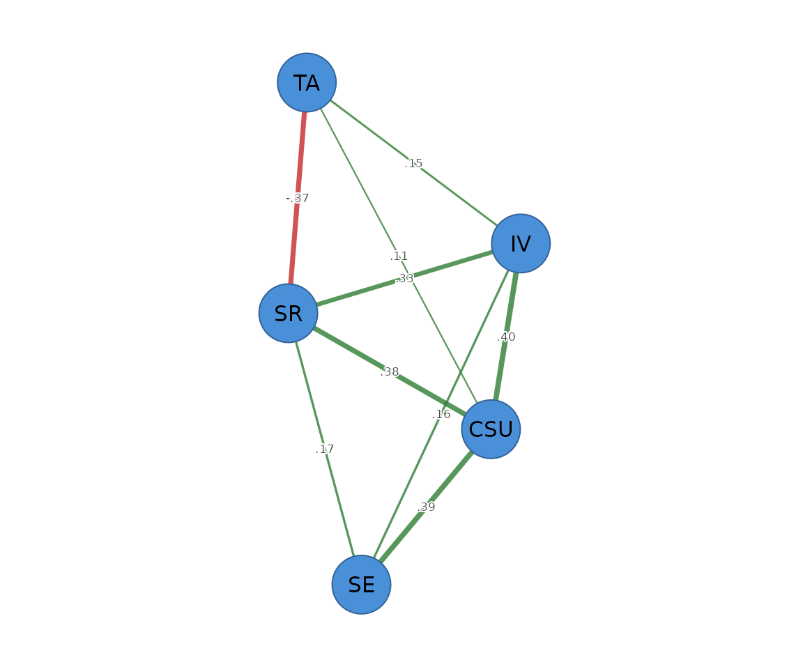

# Information-filtering networks: TMFG and LoGo

``` r

library(psychnets)
```

**Information-filtering networks** take a different route to sparsity
than the graphical lasso. Instead of penalising edges, they keep a
fixed, theoretically motivated *topology* and let the data fill in the
weights.

- **TMFG** (Triangulated Maximally Filtered Graph, `method = "tmfg"`)
  greedily builds a planar, chordal graph with exactly `3(p - 2)` edges
  – the strongest associations that still form a triangulated structure.
- **LoGo** (Local-Global, `method = "logo"`) takes the TMFG topology and
  returns the *closed-form* sparse inverse covariance (a
  partial-correlation network) for that chordal graph – no iteration, no
  tuning.

Both are deterministic and dependency-free, and both carry a structural
certificate.

``` r

tmfg <- psychnet(SRL_GPT, method = "tmfg")
logo <- psychnet(SRL_GPT, method = "logo")

tmfg
#> <psychnet> tmfg network
#>   nodes: 5   edges: 9   (undirected)
logo
#> <psychnet> logo network
#>   nodes: 5   edges: 9   (undirected)
#>   optimality (KKT residual): 6.66e-16
```

With only five nodes the filter is mild (a 5-node graph has 10 possible
edges and TMFG keeps `3(5 - 2) = 9`); the method shows its value on
larger node sets, where it drops the great majority of edges. The TMFG
certificate confirms the graph has the correct edge count and is chordal
and connected:

``` r

certificate(tmfg)
#>   method certificate       kind certified
#> 1   tmfg           0 structural      TRUE
```

The LoGo edges are the partial correlations on the TMFG backbone:

``` r

as.data.frame(logo)
#>   from to     weight
#> 1  CSU IV  0.4035714
#> 2  CSU SE  0.3934966
#> 3   IV SE  0.1648976
#> 4  CSU SR  0.3771675
#> 5   IV SR  0.3300708
#> 6   SE SR  0.1681288
#> 7  CSU TA  0.1100782
#> 8   IV TA  0.1463203
#> 9   SR TA -0.3720398
```

## Plotting

LoGo weights the TMFG backbone with partial correlations. Pass the
network object to
[`cograph::splot()`](https://sonsoles.me/cograph/reference/splot.html)
with `psych_styling = TRUE` (spring layout, green = positive, red =
negative); ask for the predictability ring with `predictability = TRUE`.

``` r

cograph::splot(logo, psych_styling = TRUE, predictability = TRUE)
```



LoGo reproduces the sample correlation exactly on the TMFG support (its
defining property), so its constrained-MLE certificate is near zero:

``` r

certificate(logo)
#>   method  certificate kind certified
#> 1   logo 6.661338e-16  kkt      TRUE
```
