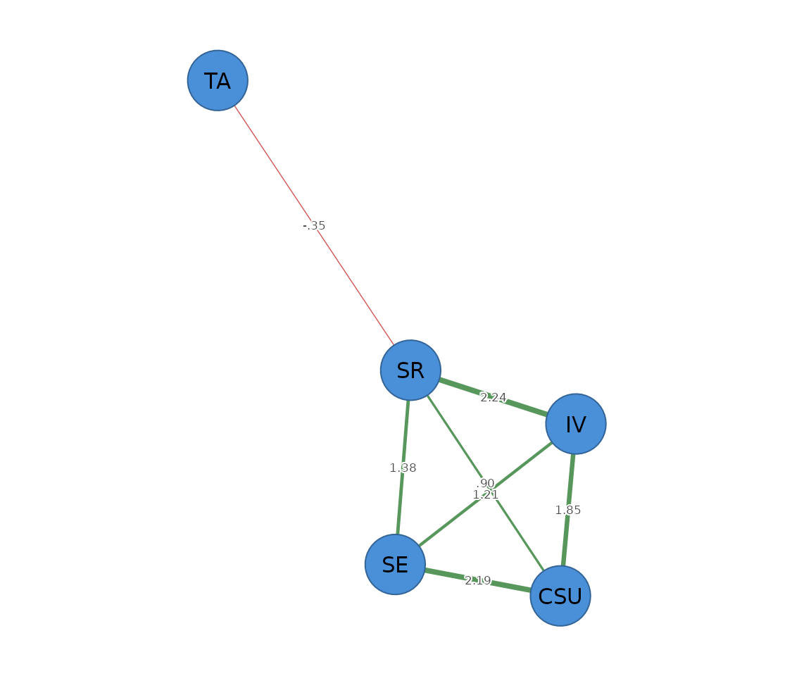

# Ising networks for binary data

``` r

library(psychnets)
```

The **Ising model** is the binary analogue of the Gaussian graphical
model: a network for **0/1 data**, where each edge is a conditional
association between two binary variables. `psychnets` fits it by
nodewise L1-penalised logistic regression with EBIC selection
(`method = "ising"`, equivalent to
[`IsingFit::IsingFit()`](https://rdrr.io/pkg/IsingFit/man/isingfit.html)),
or unregularised with Wald-based pruning (`method = "ising_sampler"`).
Both self-certify via the nodewise GLM stationarity residual.

## Dichotomising

The construct scores are continuous, so we first binarise them with
[`dichotomize()`](https://pak.dynasite.org/psychnets/reference/dichotomize.md)
– here into “high” vs “low” on each construct. A median split on coarse
data is often badly unbalanced; `method = "rank"` gives a balanced
~50/50 split robust to ties.

``` r

bin <- dichotomize(SRL_GPT, method = "rank")
colMeans(bin)             # endorsement ("high") rate per construct (~0.5)
#> CSU  IV  SE  SR  TA 
#> 0.5 0.5 0.5 0.5 0.5
```

## Fitting the Ising network

``` r

fit <- psychnet(bin, method = "ising", rule = "AND")
fit
#> <psychnet> ising network
#>   nodes: 5   edges: 7   (undirected)
#>   optimality (KKT residual): 3.74e-10
certificate(fit)
#>   method certificate kind certified
#> 1  ising 3.74261e-10  kkt      TRUE
```

The edges are the symmetrised conditional associations between
constructs:

``` r

as.data.frame(fit)
#>   from to     weight
#> 1  CSU IV  1.8544649
#> 2  CSU SE  2.1878175
#> 3   IV SE  1.2096869
#> 4  CSU SR  0.9036773
#> 5   IV SR  2.2416461
#> 6   SE SR  1.3762314
#> 7   SR TA -0.3468242
```

Predictability for binary nodes is classification accuracy above the
marginal baseline (`nCC`); it needs the data the model was fit on:

``` r

net_predict(fit, data = bin)
#>   node   type metric predictability  accuracy
#> 1  CSU binary    nCC      0.7066667 0.8533333
#> 2   IV binary    nCC      0.7266667 0.8633333
#> 3   SE binary    nCC      0.7000000 0.8500000
#> 4   SR binary    nCC      0.7133333 0.8566667
#> 5   TA binary    nCC      0.0000000 0.5000000
```

## Regularised vs unregularised

`method = "ising_sampler"` is the unregularised counterpart; with
`alpha` it prunes edges by a Wald p-value instead of shrinking them.

``` r

samp <- psychnet(bin, method = "ising_sampler", alpha = 0.05)
as.data.frame(samp)
#>   from to     weight
#> 1  CSU IV  1.9267940
#> 2  CSU SE  2.2813844
#> 3   IV SE  1.3017708
#> 4  CSU SR  0.9405096
#> 5   IV SR  2.3094982
#> 6   SE SR  1.4857428
#> 7   SR TA -0.7694226
```

## Plotting

Pass the network object to
[`cograph::splot()`](https://sonsoles.me/cograph/reference/splot.html)
with `psych_styling = TRUE` (spring layout, green = positive, red =
negative); ask for the predictability ring with `predictability = TRUE`.

``` r

cograph::splot(fit, psych_styling = TRUE, predictability = TRUE)
```


