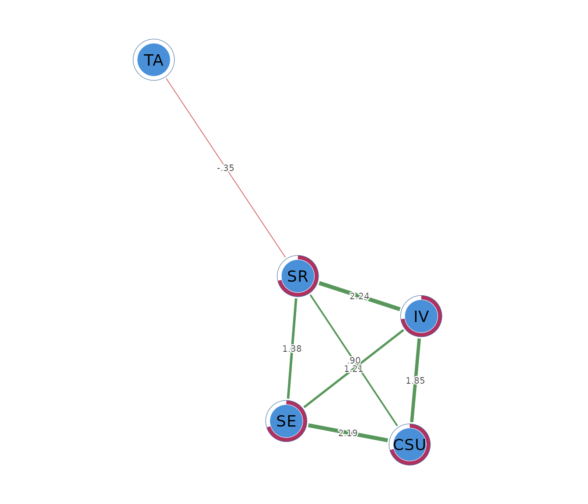

# Ising networks for binary data

## What an Ising network is

An Ising network describes associations among binary variables. A node
can represent whether a symptom is present, whether a student passed an
assessment, or whether a respondent endorsed an item. Each variable must
have two states, which `psychnets` represents as 0 and 1.

An edge asks whether two binary variables remain associated above and
beyond the other variables in the network. Consider a network of study
behaviours. A positive edge between planning and completing assignments
means that students who plan are more likely to complete assignments
after their other recorded behaviours have been taken into account. A
negative edge means that endorsement of one variable is associated with
lower conditional odds of endorsing the other.

The model filters negligible conditional associations that may reflect
sampling noise. A missing edge means that the fitted model did not
retain unique information between that pair after considering the other
nodes. It does not mean that their ordinary association must be zero,
and an edge does not identify a causal effect.

## The data

The worked example uses `SRL_GPT`, which contains 300 observations on
cognitive strategy use (`CSU`), intrinsic value (`IV`), self-efficacy
(`SE`), self-regulation (`SR`), and test anxiety (`TA`). The original
variables are continuous composite scores. An Ising model requires
binary data, so the example uses
[`dichotomize()`](https://pak.dynasite.org/psychnets/reference/dichotomize.md)
with `method = "rank"` to code the lower half of each score as 0 and the
upper half as 1.

``` r

head(binary_data)
#>      CSU IV SE SR TA
#> [1,]   0  0  0  0  1
#> [2,]   1  1  1  1  1
#> [3,]   1  1  1  1  0
#> [4,]   0  1  1  0  1
#> [5,]   0  0  0  0  1
#> [6,]   0  0  0  0  0
```

The rank rule gives each variable an endorsement rate of 0.50 in these
data. Here, a value of 1 means that the observation falls in the upper
half of that construct. Dichotomization discards information from the
original scale, so it should be used only when a binary research
question is substantively justified. Naturally binary variables can be
analyzed directly.

## Fitting the network with `psychnet()`

[`psychnet()`](https://pak.dynasite.org/psychnets/reference/psychnet.md)
estimates an Ising network when `method = "ising"`. The default AND rule
retains an edge when both nodewise models select it. The function
returns a fitted `psychnet` object containing the symmetric interaction
weights, node thresholds, and numerical certificate.

``` r

ising_net <- psychnet(data = binary_data, method = "ising", rule = "AND")
ising_net
#> <psychnet> ising network
#>   nodes: 5   edges: 7   (undirected)
#>   optimality (KKT residual): 3.74e-10
```

The fitted network contains 5 nodes and 7 edges. Three of the ten
possible pairs are removed by the selected model.

## Inspecting interactions with `summary()`

[`summary()`](https://rdrr.io/r/base/summary.html) prints the fitted
network and returns the edge table invisibly. The columns `from`, `to`,
and `weight` identify the retained interactions. Positive weights
indicate higher conditional odds of joint endorsement. Negative weights
indicate lower conditional odds.

``` r

summary(ising_net)
#> <psychnet> ising network
#>   nodes: 5   edges: 7   (undirected)
#>   optimality (KKT residual): 3.74e-10
#>   edge weight: range [-0.347, 2.242], mean 1.347
```

The six retained edges among `CSU`, `IV`, `SE`, and `SR` are positive.
The largest is `IV`-`SR` at 2.242, followed by `CSU`-`SE` at 2.188.
Students in the upper half of one construct have higher conditional odds
of being in the upper half of the connected construct after the other
binary variables are considered.

The `SR`-`TA` edge is negative (-0.347). Upper-half self-regulation is
associated with lower conditional odds of upper-half test anxiety after
cognitive strategy use, intrinsic value, and self-efficacy are taken
into account. Test anxiety has no other retained edge in this model.

Ising weights are logistic interaction coefficients, not correlations.
Their magnitudes should therefore be interpreted on the model’s log-odds
scale and compared within the fitted network.

## Checking numerical optimality with `certificate()`

[`certificate()`](https://pak.dynasite.org/psychnets/reference/certificate.md)
reports the largest stationarity residual across the fitted nodewise
logistic models. It returns `method`, `certificate`, `kind`, and
`certified`. A small residual indicates that the optimization satisfies
its first-order conditions to the requested tolerance.

``` r

certificate(ising_net)
#>   method certificate kind certified
#> 1  ising 3.74261e-10  kkt      TRUE
```

The residual is $`3.74 \times 10^{-10}`$ and `certified` is `TRUE`. This
value is close to machine precision and indicates that the penalized
logistic fits satisfy their numerical conditions to numerical precision.
The certificate checks optimization, not sampling stability, measurement
validity, or causation.

## Describing node position with `net_centralities()`

[`net_centralities()`](https://pak.dynasite.org/psychnets/reference/net_centralities.md)
returns `node`, `strength`, and `expected_influence` by default.
Strength sums the absolute interaction weights. Expected influence sums
the signed weights, so negative connections reduce the total.

``` r

net_centralities(ising_net)
#>   node  strength expected_influence
#> 1  CSU 4.9459597          4.9459597
#> 2   IV 5.3057980          5.3057980
#> 3   SE 4.7737358          4.7737358
#> 4   SR 4.8683790          4.1747307
#> 5   TA 0.3468242         -0.3468242
```

Intrinsic value has the highest strength (5.306), followed by cognitive
strategy use (4.946). Self-regulation has strength 4.868 and expected
influence 4.175 because its negative connection with test anxiety
reduces the signed sum. Test anxiety has one edge, giving strength 0.347
and expected influence -0.347.

These indices describe connection patterns in the estimated binary
network. They do not show which construct should be targeted by an
intervention.

## Evaluating binary predictability with `net_predict()`

[`net_predict()`](https://pak.dynasite.org/psychnets/reference/net_predict.md)
evaluates how accurately each node is classified from the others. Binary
nodes use normalized classification accuracy (`nCC`). An `nCC` of 0
means that prediction is no better than always choosing the more
frequent category. An `nCC` of 1 means perfect classification. The
`accuracy` column reports the unadjusted proportion classified
correctly.

``` r

net_predict(ising_net, data = binary_data)
#>   node   type metric predictability  accuracy
#> 1  CSU binary    nCC      0.7066667 0.8533333
#> 2   IV binary    nCC      0.7266667 0.8633333
#> 3   SE binary    nCC      0.7000000 0.8500000
#> 4   SR binary    nCC      0.7133333 0.8566667
#> 5   TA binary    nCC      0.0000000 0.5000000
```

Intrinsic value has the highest normalized accuracy (0.727) and a raw
accuracy of 0.863. Cognitive strategy use, self-efficacy, and
self-regulation have `nCC` values from 0.700 to 0.713 and raw accuracies
near 0.85. Their neighbours provide substantial classification
information beyond the 0.50 marginal baseline.

Test anxiety has `nCC = 0` and accuracy 0.50. Its neighbour does not
improve classification beyond the marginal baseline in the penalized
model. These are in-sample values; assessment on new observations
requires validation data.

## Comparing an unregularized Ising estimator

[`psychnet()`](https://pak.dynasite.org/psychnets/reference/psychnet.md)
fits unregularized nodewise logistic models when
`method = "ising_sampler"`. The argument `alpha = 0.05` removes edges
whose Wald tests exceed the selected level. This comparison checks
whether the main structure persists under a different estimation
procedure.

``` r

unregularized_net <- psychnet(data = binary_data, method = "ising_sampler", alpha = 0.05)
unregularized_net
#> <psychnet> ising_sampler network
#>   nodes: 5   edges: 7   (undirected)
#>   optimality (KKT residual): 1.38e-08
```

``` r

summary(unregularized_net)
#> <psychnet> ising_sampler network
#>   nodes: 5   edges: 7   (undirected)
#>   optimality (KKT residual): 1.38e-08
#>   edge weight: range [-0.769, 2.309], mean 1.354
```

The unregularized model retains the same 7 edges. Its positive
learning-cluster interactions are slightly larger, and the `SR`-`TA`
edge is -0.769 compared with -0.347 in the penalized model. The shared
structure provides evidence that the main qualitative pattern is not
specific to the penalized estimator. The change in magnitude reflects
the different estimation and pruning procedures.

``` r

certificate(unregularized_net)
#>          method  certificate kind certified
#> 1 ising_sampler 1.384701e-08  kkt      TRUE
```

The residual is $`1.38 \times 10^{-8}`$ and `certified` is `TRUE`,
indicating that the unregularized nodewise fits satisfy their score
conditions within the default tolerance.

## Visualizing the network with `cograph::splot()`

[`cograph::splot()`](https://sonsoles.me/cograph/reference/splot.html)
draws the network when the optional `cograph` package is available.
Psychological styling uses green for positive interactions and red for
negative interactions. Predictability rings summarize node
classification.

``` r

cograph::splot(ising_net, psych_styling = TRUE, predictability = TRUE)
```



Node placement is determined by a layout algorithm and has no
statistical scale. The edge table remains the primary source for
numerical interpretation.

## Reporting the analysis

A report should define what 0 and 1 mean for every node, describe any
dichotomization rule, state the sample size, estimator, EBIC setting,
edge rule, and missing-data procedure, and report interaction weights
numerically. Results should be described as conditional associations on
a log-odds scale.

The present analysis used rank dichotomization, 300 complete
observations, the EBIC-regularized Ising estimator, and the AND rule.
The model retained 7 edges. The largest interaction was `IV`-`SR`
(2.242), and `SR`-`TA` was negative (-0.347). The KKT residual was
$`3.74 \times 10^{-10}`$. An unregularized sensitivity model retained
the same edge set.

## How the Ising network is estimated

Each binary node is modeled with logistic regression using the remaining
nodes as predictors. The regularized estimator applies an $`\ell_1`$
penalty and selects a penalty value by EBIC for every node. Small
coefficients can be set to zero, which removes the corresponding
neighbour from that node’s model.

Each pair receives two estimates because either node can be treated as
the outcome. The AND rule retains a pair when both regressions select it
and averages the two estimates into one undirected interaction. The OR
rule retains a pair when either regression selects it.

## Mathematical foundations

For a binary vector $`\mathbf{x} \in \{0,1\}^p`$, the Ising model is

``` math
P(\mathbf{x}) = \frac{1}{Z}\exp\left(
\sum_i \tau_i x_i + \sum_{i<j}\omega_{ij}x_ix_j
\right),
```

where $`\tau_i`$ is a node threshold, $`\omega_{ij}`$ is an interaction,
and $`Z`$ is the normalizing constant. The conditional model for node
$`i`$ is

``` math
\operatorname{logit}P(X_i=1\mid\mathbf{X}_{-i})
= \tau_i + \sum_{j\ne i}\omega_{ij}X_j.
```

The regularized estimator minimizes the negative nodewise log-likelihood
plus $`\lambda\sum_{j\ne i}|\omega_{ij}|`$. EBIC selects $`\lambda`$.
The certificate is the largest violation of the penalized logistic
stationarity conditions across all nodes.

For binary predictability, normalized classification accuracy is

``` math
\operatorname{nCC}_j
= \frac{\operatorname{CC}_j-m_j}{1-m_j},
```

where $`\operatorname{CC}_j`$ is classification accuracy and $`m_j`$ is
the larger marginal class proportion.
