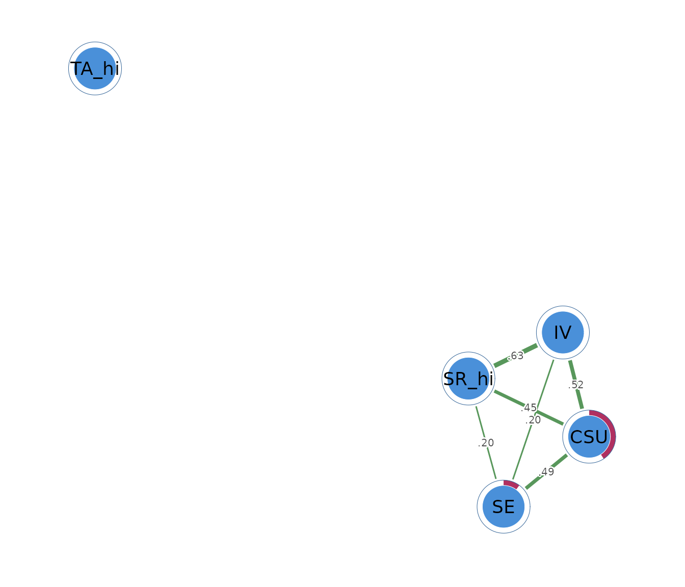

# Mixed graphical models

## What a mixed graphical model is

A mixed graphical model analyzes continuous and binary variables in the
same network. A continuous node can represent a scale score or measured
quantity. A binary node can represent symptom presence, group
membership, or a yes/no response.

Each edge describes an association that remains above and beyond the
other variables. Consider a network with continuous motivation and
self-efficacy scores together with binary indicators for assignment
completion and high test anxiety. An edge between motivation and
assignment completion means that motivation remains associated with the
conditional probability of completion after self-efficacy, anxiety, and
the other nodes have been considered.

A positive edge indicates that higher values or endorsement tend to
occur together after adjustment. A negative edge indicates an inverse
adjusted relation. A missing edge means that the selected model did not
retain enough unique association for that pair. Edges remain
associational and provide no causal direction.

## The data

The example uses three continuous `SRL_GPT` scores: cognitive strategy
use (`CSU`), intrinsic value (`IV`), and self-efficacy (`SE`).
Self-regulation and test anxiety are represented by binary indicators,
`SR_hi` and `TA_hi`, coded 1 at or above their respective medians and 0
below them.

``` r

head(mixed_data)
#>        CSU       IV       SE SR_hi TA_hi
#> 1 5.307692 5.666667 5.777778     0     1
#> 2 5.846154 6.444444 6.000000     1     1
#> 3 6.615385 6.666667 6.222222     1     0
#> 4 5.692308 6.555556 6.333333     1     1
#> 5 4.384615 5.555556 4.888889     0     1
#> 6 4.846154 5.444444 5.666667     0     0
```

The self-regulation indicator has an endorsement rate of 0.54, and the
test-anxiety indicator has a rate of 0.50. The example coding is
pedagogical. Real applications should preserve continuous variables when
the research question concerns their full scale and should use binary
coding only when the two states have a meaningful interpretation.

## Fitting the network with `psychnet()`

[`psychnet()`](https://pak.dynasite.org/psychnets/reference/psychnet.md)
estimates a mixed graphical model when `method = "mgm"`. It detects 0/1
columns as binary and other numeric columns as Gaussian. The default AND
rule retains an edge when both nodewise models select the relation.

``` r

mixed_net <- psychnet(data = mixed_data, method = "mgm")
mixed_net
#> <psychnet> mgm network
#>   nodes: 5   edges: 6   (undirected)
#>   optimality (KKT residual): 7.58e-08
```

The fitted network contains 5 nodes and 7 edges. The printed KKT
residual is $`7.58 \times 10^{-8}`$.

## Inspecting mixed edges with `summary()`

[`summary()`](https://rdrr.io/r/base/summary.html) prints the fitted
model and returns a table with `from`, `to`, and `weight`. The weights
are standardized nodewise interaction estimates combined into an
undirected network.

``` r

summary(mixed_net)
#> <psychnet> mgm network
#>   nodes: 5   edges: 6   (undirected)
#>   optimality (KKT residual): 7.58e-08
#>   edge weight: range [0.196, 0.632], mean 0.413
```

The largest edge joins intrinsic value and high self-regulation
(`IV`-`SR_hi`, 0.632). Higher intrinsic value is associated with higher
conditional odds of belonging to the high self-regulation group after
the other nodes have been taken into account. The `CSU`-`IV` and
`CSU`-`SE` edges are also positive, at 0.518 and 0.485.

The `SR_hi`-`TA_hi` edge is negative (-0.168). High self-regulation is
associated with lower conditional odds of high test anxiety after the
continuous learning constructs are considered. Test anxiety has no other
retained edge.

Edge scales depend on the types of the connected nodes, so magnitudes
should be compared cautiously across Gaussian-Gaussian, Gaussian-binary,
and binary-binary pairs. For a binary-binary pair, the implementation
retains the sign of the nodewise logistic coefficient. Some mixed-model
software reports only its magnitude because the categorical-categorical
sign depends on coding convention.

## Checking numerical optimality with `certificate()`

[`certificate()`](https://pak.dynasite.org/psychnets/reference/certificate.md)
reports the largest stationarity residual among the nodewise models. It
returns `method`, `certificate`, `kind`, and `certified`.

``` r

certificate(mixed_net)
#>   method  certificate kind certified
#> 1    mgm 7.581922e-08  kkt      TRUE
```

The residual is $`7.58 \times 10^{-8}`$ and `certified` is `TRUE`. It is
below the default tolerance of $`10^{-6}`$ and indicates that the
nodewise penalized models satisfy their numerical conditions within that
tolerance. The certificate does not assess measurement quality, sampling
stability, or causation.

## Describing node position with `net_centralities()`

[`net_centralities()`](https://pak.dynasite.org/psychnets/reference/net_centralities.md)
returns `node`, `strength`, and `expected_influence` by default.
Strength is the sum of absolute incident weights. Expected influence is
the signed sum.

``` r

net_centralities(mixed_net)
#>    node  strength expected_influence
#> 1   CSU 1.4539541          1.4539541
#> 2    IV 1.3473249          1.3473249
#> 3    SE 0.8777675          0.8777675
#> 4 SR_hi 1.2789975          1.2789975
#> 5 TA_hi 0.0000000          0.0000000
```

Cognitive strategy use has the largest strength (1.454), closely
followed by high self-regulation (1.447). High self-regulation has
expected influence 1.111 because its negative edge with high test
anxiety reduces the signed total. High test anxiety has strength 0.168
and expected influence -0.168.

Centrality summarizes the fitted edge pattern. It does not place
continuous and binary variables on an identical substantive scale and
does not identify causal importance.

## Evaluating predictability with `net_predict()`

[`net_predict()`](https://pak.dynasite.org/psychnets/reference/net_predict.md)
uses a metric matched to each node type. Continuous nodes report
$`R^2`$, the proportion of variance explained. Binary nodes report
normalized classification accuracy (`nCC`) and raw `accuracy`. The
function returns `node`, `type`, `metric`, `predictability`, and
`accuracy`.

``` r

net_predict(mixed_net, data = mixed_data)
#>    node     type metric predictability accuracy
#> 1   CSU gaussian     R2      0.8131079       NA
#> 2    IV gaussian     R2      0.7757368       NA
#> 3    SE gaussian     R2      0.7153497       NA
#> 4 SR_hi   binary    nCC      0.7391304     0.88
#> 5 TA_hi   binary    nCC      0.0000000     0.50
```

Cognitive strategy use has $`R^2 = 0.813`$, intrinsic value has 0.776,
and self-efficacy has 0.715. The remaining nodes explain a large
proportion of each continuous construct’s in-sample variance.

High self-regulation has `nCC = 0.739` and raw accuracy 0.880, which is
a large improvement over its marginal classification baseline. High test
anxiety has `nCC = 0.147` and accuracy 0.573. Its neighbours add little
classification information beyond the base rate. Validation on excluded
observations is needed for claims about performance on new data.

## Sensitivity to the edge-combination rule

[`psychnet()`](https://pak.dynasite.org/psychnets/reference/psychnet.md)
accepts `rule = "OR"` to retain an edge when either nodewise model
selects it. The OR rule can produce a denser network when the two
directed neighbourhood estimates disagree.

``` r

mixed_or <- psychnet(data = mixed_data, method = "mgm", rule = "OR")
mixed_or
#> <psychnet> mgm network
#>   nodes: 5   edges: 7   (undirected)
#>   optimality (KKT residual): 7.58e-08
```

``` r

summary(mixed_or)
#> <psychnet> mgm network
#>   nodes: 5   edges: 7   (undirected)
#>   optimality (KKT residual): 7.58e-08
#>   edge weight: range [-0.168, 0.632], mean 0.330
```

The OR analysis returns the same 7 edges and weights in this example.
The agreement shows that every retained pair satisfies both combination
rules. In other samples, pairs selected in only one direction would
appear under OR and be removed under AND.

## Visualizing the network with `cograph::splot()`

[`cograph::splot()`](https://sonsoles.me/cograph/reference/splot.html)
draws the fitted object when `cograph` is available. Green and red edges
encode positive and negative weights, and predictability rings summarize
the node-specific metric.

``` r

cograph::splot(mixed_net, psych_styling = TRUE, predictability = TRUE)
```



The plot provides orientation, while the edge and predictability tables
provide the numerical results. Layout distances have no statistical
scale.

## Reporting the analysis

A report should identify each node as continuous or binary, define the
binary coding, state the sample size, EBIC setting, threshold,
combination rule, and missing-data procedure, and report the edge
weights numerically. Predictability must be reported with the correct
metric for each node type.

The present analysis used 300 complete observations, three Gaussian
nodes, two binary nodes, and the default AND rule. The model retained 7
edges. The largest edge was `IV`-`SR_hi` (0.632), and `SR_hi`-`TA_hi`
was negative (-0.168). The KKT residual was $`7.58 \times 10^{-8}`$. The
OR sensitivity analysis returned the same network.

## How the mixed network is estimated

Every node is regressed on the remaining nodes with a model matched to
its type. A continuous outcome uses linear regression and a binary
outcome uses logistic regression. An $`\ell_1`$ penalty filters weak
coefficients, and EBIC selects the penalty separately for each node.

Each pair receives two directed estimates. The edge-combination rule
determines whether the pair is retained, and the selected directed
estimates are averaged to produce an undirected weight. Continuous
variables are standardized during estimation so their arbitrary units do
not determine the Gaussian coefficients.

The current implementation supports Gaussian and binary 0/1 nodes.
Numeric variables with more than two integer levels require an explicit
binary recoding or one-hot encoding before fitting.

## Mathematical foundations

A mixed graphical model is a pairwise Markov random field,

``` math
p(x_1,\ldots,x_p) \propto \exp\left(
\sum_j\phi_j(x_j)+\sum_{j<k}\phi_{jk}(x_j,x_k)
\right).
```

A zero pairwise potential removes the corresponding conditional
association. For node $`j`$, estimation minimizes

``` math
\frac{1}{n}\sum_{i=1}^n
\ell\left(x_{ij},\beta_0+\mathbf{x}_{i,-j}^{\mathsf T}\boldsymbol\beta\right)
+\lambda_j\lVert\boldsymbol\beta\rVert_1,
```

where $`\ell`$ is Gaussian or binomial negative log-likelihood. The
certificate is the largest KKT residual across the nodewise objectives.

For continuous nodes, predictability is
$`R^2=1-\operatorname{RSS}/\operatorname{TSS}`$. For a binary node
$`j`$,

``` math
\operatorname{nCC}_j
=\frac{\operatorname{CC}_j-m_j}{1-m_j},
```

where $`m_j`$ is the larger marginal class proportion.
