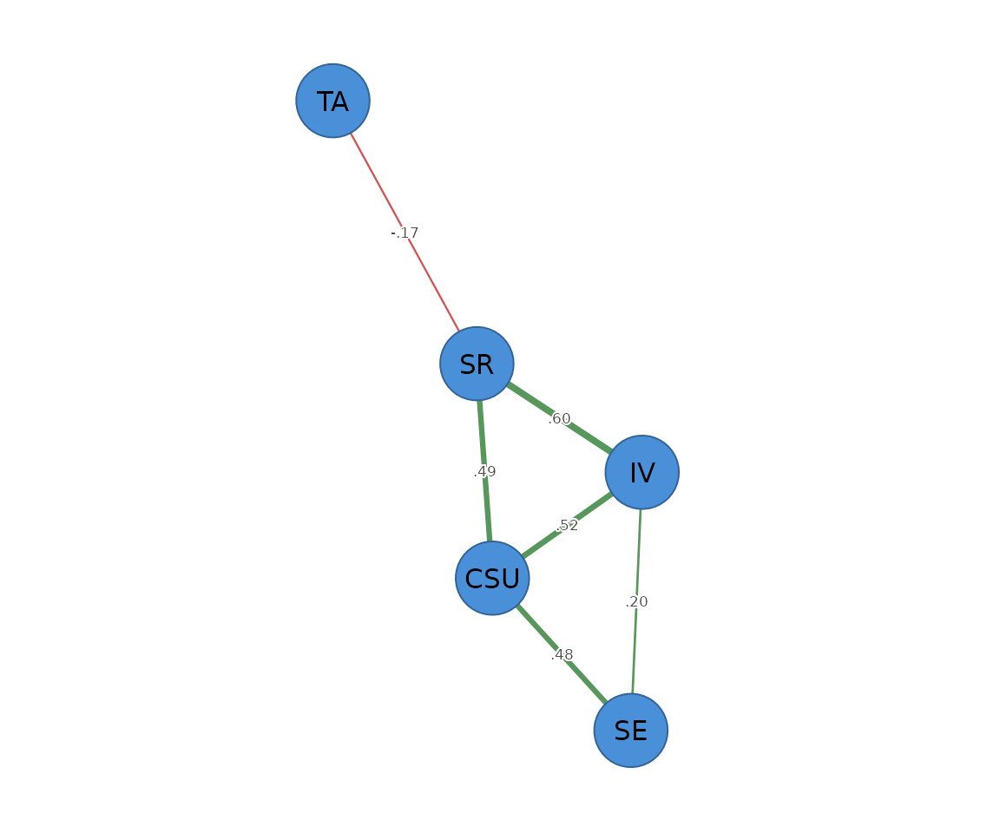

# Mixed graphical models

``` r

library(psychnets)
```

A **mixed graphical model** (`method = "mgm"`) estimates a network over
variables of *different types in the same model* – here continuous
(Gaussian) and binary nodes. Each node is regressed on all the others
with the L1-penalised GLM that matches its type (linear for continuous,
logistic for binary), and the asymmetric estimates are symmetrised by
the AND rule. It is equivalent to
[`mgm::mgm()`](https://rdrr.io/pkg/mgm/man/mgm.html) for the Gaussian +
binary case, and self-certifies via the nodewise GLM residual.

## Building a mixed data set

We keep three constructs continuous (`CSU`, `IV`, `SE`) and treat two as
binary (`SR`, `TA`) – as if self-regulation and test anxiety had been
recorded as high/low. A small helper dichotomises the binary pair with
`dichotomize(method = "rank")` and binds them to the three continuous
constructs.

``` r

mixed_scores <- function(x) {
  d <- as.data.frame(x)
  b <- dichotomize(d[c("SR", "TA")], method = "rank")
  data.frame(d[c("CSU", "IV", "SE")], SR = b[, "SR"], TA = b[, "TA"])
}

mixed <- mixed_scores(SRL_GPT)
head(mixed)
#>        CSU       IV       SE SR TA
#> 1 5.307692 5.666667 5.777778  0  1
#> 2 5.846154 6.444444 6.000000  1  1
#> 3 6.615385 6.666667 6.222222  1  0
#> 4 5.692308 6.555556 6.333333  0  1
#> 5 4.384615 5.555556 4.888889  0  1
#> 6 4.846154 5.444444 5.666667  0  0
```

## The fitted network

[`psychnet()`](https://pak.dynasite.org/psychnets/reference/psychnet.md)
auto-detects each column’s type and fits the matching GLM nodewise:

``` r

fit <- psychnet(mixed, method = "mgm")
fit
#> <psychnet> mgm network
#>   nodes: 5   edges: 6   (undirected)
#>   optimality (KKT residual): 6.12e-08
certificate(fit)
#>   method  certificate kind certified
#> 1    mgm 6.120379e-08  kkt      TRUE
```

The edges, and the per-node type and predictability (R-squared for the
Gaussian nodes, normalised accuracy `nCC` for the binary ones):

``` r

as.data.frame(fit)
#>   from to     weight
#> 1  CSU IV  0.5178986
#> 2  CSU SE  0.4761172
#> 3   IV SE  0.1974848
#> 4  CSU SR  0.4857058
#> 5   IV SR  0.5989477
#> 6   SR TA -0.1657993
net_predict(fit, data = mixed)
#>   node     type metric predictability accuracy
#> 1  CSU gaussian     R2      0.8150679       NA
#> 2   IV gaussian     R2      0.7722005       NA
#> 3   SE gaussian     R2      0.7055418       NA
#> 4   SR   binary    nCC      0.7400000     0.87
#> 5   TA   binary    nCC      0.0000000     0.50
```

A binary–binary edge carries the sign of its nodewise-logistic
coefficient, which [`mgm::mgm()`](https://rdrr.io/pkg/mgm/man/mgm.html)
leaves undefined, so compare such edges on
[`abs()`](https://rdrr.io/r/base/MathFun.html). The edge magnitudes
otherwise match [`mgm::mgm()`](https://rdrr.io/pkg/mgm/man/mgm.html)
closely.

## Plotting

Pass the network object to
[`cograph::splot()`](https://sonsoles.me/cograph/reference/splot.html)
with `psych_styling = TRUE` (green = positive, red = negative); ask for
the predictability ring with `predictability = TRUE`.

``` r

cograph::splot(fit, psych_styling = TRUE, predictability = TRUE)
```



`method = "mgm"` (v0.1) supports Gaussian and binary nodes; a
multi-level categorical column is rejected with a clear message (one-hot
encode it first). See `net_crosswalk("mgm")` for the argument map
against [`mgm::mgm()`](https://rdrr.io/pkg/mgm/man/mgm.html).
