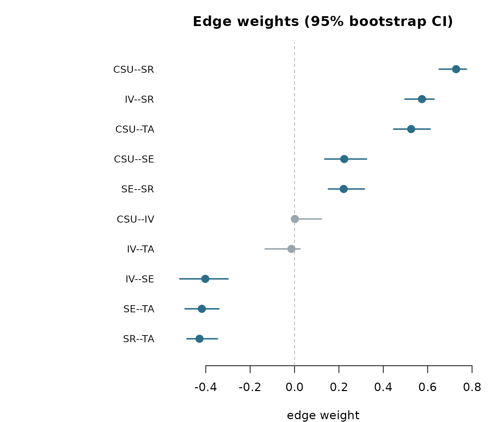
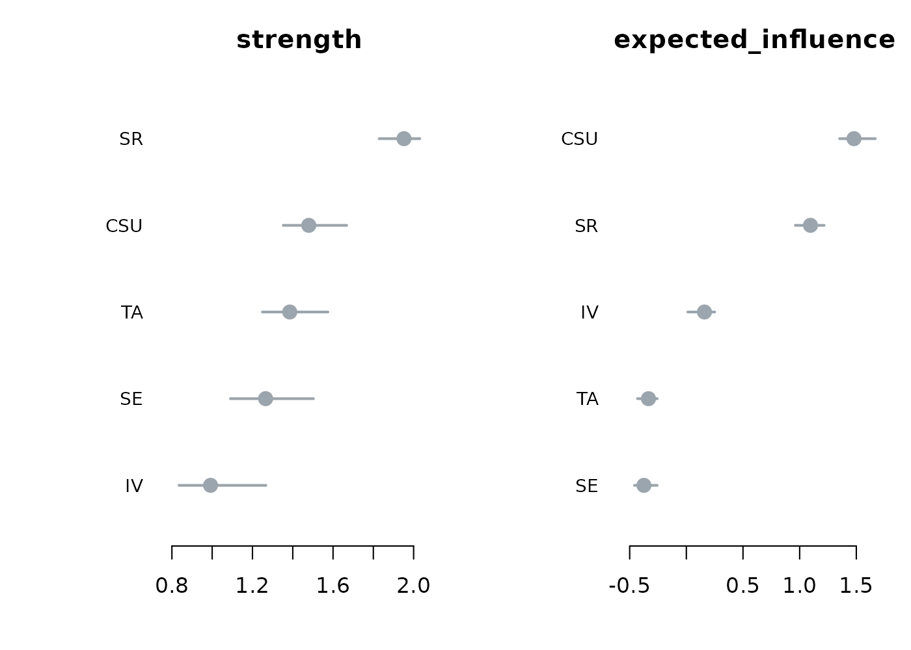
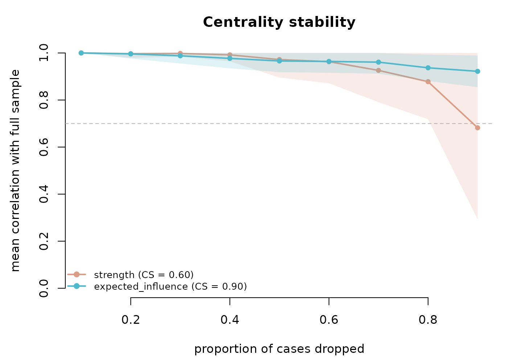
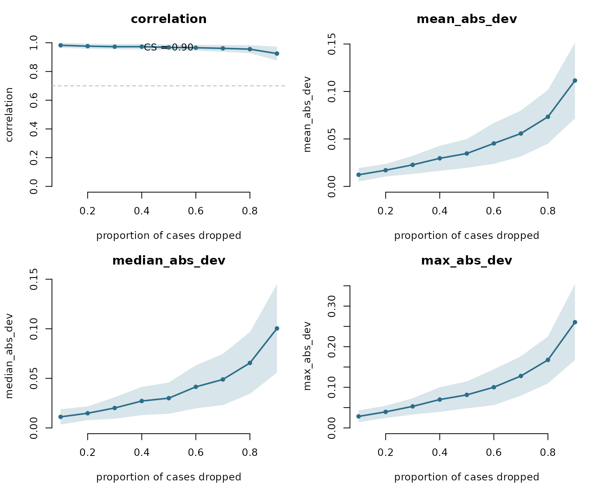
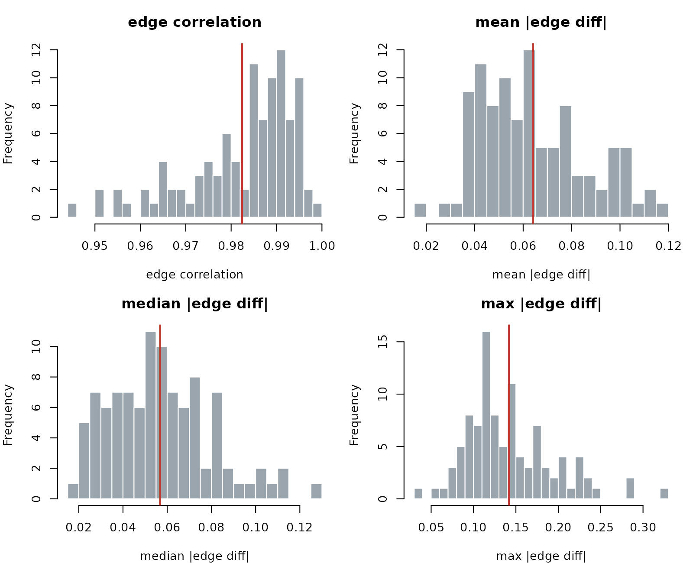

# Edge-weight stability and split-half reliability

## What network accuracy and stability are

A psychometric network is an estimate. Every edge weight and every
centrality value is computed from a finite sample, so each carries
sampling variability. A network drawn from one sample would differ from
a network drawn from another sample of the same population. Reliability
analysis is the set of resampling diagnostics that quantify this
variability and report how much of the estimated structure is
reproducible.

Four questions organise the diagnostics in this vignette. How wide is
the sampling interval around each edge weight, and does that interval
exclude zero? Do the differences between edges or between centralities
survive resampling? Do the centrality rankings hold up when cases are
dropped? Does the whole edge structure reproduce across independent
halves of the sample? The verbs
[`net_boot()`](https://pak.dynasite.org/psychnets/reference/net_boot.md),
[`difference_test()`](https://pak.dynasite.org/psychnets/reference/difference_test.md),
[`net_stability()`](https://pak.dynasite.org/psychnets/reference/net_stability.md),
[`casedrop_reliability()`](https://pak.dynasite.org/psychnets/reference/casedrop_reliability.md),
and
[`network_reliability()`](https://pak.dynasite.org/psychnets/reference/network_reliability.md)
answer these in turn. Every verb is estimator-agnostic: each routes its
refits through `psychnet(method = )`, so the same diagnostic applies to
any estimator in the package, and each is written in base R with no
compiled dependency.

## The data

The bundled `SRL_Claude` data set holds 300 respondents scored on five
self-regulated-learning subscales: cognitive strategy use (CSU),
intrinsic value (IV), self-efficacy (SE), self-regulation (SR), and test
anxiety (TA).

``` r

head(SRL_Claude)
#>        CSU       IV       SE       SR   TA
#> 1 4.615385 6.444444 4.555556 4.777778 4.00
#> 2 5.692308 7.000000 5.555556 6.222222 3.00
#> 3 5.692308 7.000000 5.777778 6.666667 3.75
#> 4 5.461538 6.222222 5.777778 5.777778 4.75
#> 5 4.846154 5.333333 5.000000 5.333333 3.75
#> 6 4.538462 4.333333 5.777778 4.000000 5.00
```

## Bootstrapped edge and centrality accuracy

[`net_boot()`](https://pak.dynasite.org/psychnets/reference/net_boot.md)
resamples the observations with replacement, re-estimates the network on
each resample, and summarises the sampling distribution of every edge
weight and every node centrality. For each edge it reports the resample
mean, the percentile confidence interval, the proportion of resamples in
which the edge is non-zero, and a `significant` flag that is `TRUE` when
the interval excludes zero. The returned object has class
`psychnet_bootstrap`; its `$edges` data frame carries the columns
`from`, `to`, `observed`, `mean`, `lower`, `upper`, `prop_nonzero`, and
`significant`, and its `$centrality` data frame carries the observed
centrality of each node with a lower and upper bound per measure.

``` r

b <- net_boot(SRL_Claude, method = "glasso", n_boot = 200, cores = 1)
b
#> <psychnet_bootstrap> glasso, 200 resamples, 95% CI
#>   10 edges (8 significant), 5 nodes, measures: strength, expected_influence
```

The header reports 200 resamples, a 95% interval, and 8 of the 10 edges
flagged significant. The edge table gives the accuracy interval behind
each estimate.

``` r

b$edges
#>    from to     observed        mean      lower      upper prop_nonzero
#> 1   CSU IV  0.001744267  0.02777141  0.0000000  0.1202986        0.550
#> 2   CSU SE  0.223973564  0.22825629  0.1360369  0.3243276        1.000
#> 3    IV SE -0.402239002 -0.40747351 -0.5171210 -0.2997294        1.000
#> 4   CSU SR  0.728177591  0.72069631  0.6520409  0.7748107        1.000
#> 5    IV SR  0.574170376  0.55984489  0.4974457  0.6284297        1.000
#> 6    SE SR  0.221496430  0.22481115  0.1522627  0.3150743        1.000
#> 7   CSU TA  0.525584044  0.52512504  0.4465139  0.6111719        1.000
#> 8    IV TA -0.013854928 -0.03375546 -0.1320652  0.0245725        0.755
#> 9    SE TA -0.417575459 -0.41986895 -0.4934429 -0.3408875        1.000
#> 10   SR TA -0.428181457 -0.42032870 -0.4852677 -0.3476119        1.000
#>    significant
#> 1        FALSE
#> 2         TRUE
#> 3         TRUE
#> 4         TRUE
#> 5         TRUE
#> 6         TRUE
#> 7         TRUE
#> 8        FALSE
#> 9         TRUE
#> 10        TRUE
```

A bootstrap confidence interval is the range of edge weights consistent
with the data at the stated level. An edge whose interval excludes zero
is a non-zero edge. The CSU–SR edge has an observed weight of 0.73 and
an interval of about 0.65 to 0.77, well clear of zero, so it is one of
the reliably non-zero edges. The CSU–IV edge has an observed weight near
0.002 and an interval from 0 to about 0.12, which includes zero, so its
sign and presence are undetermined at this sample size; the IV–TA edge
behaves the same way. The `prop_nonzero` column reads these two edges as
selected in only a part of the resamples (about 0.55 and 0.76), while
the eight significant edges are selected in every resample.

The default plot draws each edge weight with its bootstrap interval,
ordered by magnitude, with the significant edges marked.

``` r

plot(b)
```



The centrality panel does the same for the node measures.

``` r

plot(b, type = "centrality")
```



## Within-network difference tests

[`difference_test()`](https://pak.dynasite.org/psychnets/reference/difference_test.md)
tests, inside a single network, whether two edge weights or two node
centralities differ. For each pair it forms the per-resample difference
from the stored bootstrap draws, takes the percentile interval of that
difference, and flags the pair `significant` when the interval excludes
zero; it also reports the two-sided bootstrap p-value. The verb reads
the draws already stored on a
[`net_boot()`](https://pak.dynasite.org/psychnets/reference/net_boot.md)
object, so no refitting happens. It returns a tidy data frame with
columns `item1`, `item2`, `value1`, `value2`, `obs_diff`, `lower`,
`upper`, `p_value`, and `significant`. This is the within-network
counterpart to the accuracy intervals of
[`net_boot()`](https://pak.dynasite.org/psychnets/reference/net_boot.md):
it asks which nodes are ordered with confidence.

``` r

difference_test(b, type = "strength")
#>    item1 item2    value1    value2    obs_diff        lower       upper p_value
#> 1    CSU    IV 1.4794795 0.9920086  0.48747089  0.241546367  0.66372411    0.00
#> 2    CSU    SE 1.4794795 1.2652845  0.21419501  0.038286544  0.42634973    0.04
#> 3     IV    SE 0.9920086 1.2652845 -0.27327588 -0.334413124 -0.13532664    0.00
#> 4    CSU    SR 1.4794795 1.9520259 -0.47254639 -0.623609013 -0.21321640    0.00
#> 5     IV    SR 0.9920086 1.9520259 -0.96001728 -1.093928157 -0.59055176    0.00
#> 6     SE    SR 1.2652845 1.9520259 -0.68674140 -0.877109385 -0.38029431    0.00
#> 7    CSU    TA 1.4794795 1.3851959  0.09428358  0.003900685  0.19887099    0.04
#> 8     IV    TA 0.9920086 1.3851959 -0.39318731 -0.563676398 -0.15302913    0.00
#> 9     SE    TA 1.2652845 1.3851959 -0.11991143 -0.332646886  0.08003091    0.26
#> 10    SR    TA 1.9520259 1.3851959  0.56682997  0.285722615  0.69319578    0.00
#>    significant
#> 1         TRUE
#> 2         TRUE
#> 3         TRUE
#> 4         TRUE
#> 5         TRUE
#> 6         TRUE
#> 7         TRUE
#> 8         TRUE
#> 9        FALSE
#> 10        TRUE
```

A two-sided bootstrap p-value is the probability, under resampling, of a
difference at least as large as the observed one when the two quantities
are equal. Self-regulation (SR) has the highest observed strength at
1.95, and its difference from every other node has an interval excluding
zero and a p-value of 0.00, so SR ranks above the rest with confidence.
The SE–TA pair is the exception: its observed strength difference is
about -0.12, its interval runs from about -0.33 to 0.08 and includes
zero, and its p-value is 0.26, so the strengths of SE and TA are not
distinguishable here. A ranking that separates those two nodes would not
be supported by the data.

## Centrality stability under case-dropping

[`net_stability()`](https://pak.dynasite.org/psychnets/reference/net_stability.md)
re-estimates the network on random case-dropped subsets and correlates
each subset’s centralities, by Spearman rank, with the full-sample
centralities. The correlation-stability coefficient, or CS-coefficient,
is the largest proportion of cases that can be dropped while the rank
correlation with the full-sample centrality stays at or above a
threshold (0.7 by default) with a stated probability (0.95 by default).
The returned `psychnet_stability` object holds `$cs`, the CS-coefficient
per measure, and a tidy `$table` with columns `measure`, `drop_prop`,
`mean_cor`, `sd_cor`, and `prop_above`.

``` r

st <- net_stability(SRL_Claude, method = "glasso", iter = 100)
st
#> <psychnet_stability> glasso, 100 subsets/proportion
#>   CS-coefficient (cor >= 0.70 with 95% certainty):
#>     strength             0.60
#>     expected_influence   0.90
```

The CS-coefficient for strength is 0.60 and for expected influence is
0.90. The interpretation of a CS-coefficient of 0.60 is that up to 60%
of the cases can be dropped and the strength ranking still correlates at
least 0.7 with the full-sample ranking in 95% of subsets. A common rule
of thumb sets 0.25 as the minimum and 0.50 as the preferred value for a
centrality ordering that can be read with confidence; both measures here
sit above 0.50, and expected influence is close to the maximum. The plot
draws the mean correlation against the drop proportion with a
plus-or-minus one standard deviation band and the acceptance threshold.

``` r

plot(st)
```



## Edge-weight case-dropping stability

[`casedrop_reliability()`](https://pak.dynasite.org/psychnets/reference/casedrop_reliability.md)
provides the edge-vector complement of
[`net_stability()`](https://pak.dynasite.org/psychnets/reference/net_stability.md).
For each drop proportion it re-estimates the network on random
case-dropped subsets and compares the subset edge-weight vector with the
full-sample one, reporting the correlation between the two vectors
together with the mean, median, and maximum absolute edge deviation. The
edge-weight CS-coefficient is the largest drop proportion at which the
edge-vector correlation stays at or above the threshold with the stated
probability. The result is a tidy data frame of class
`psychnet_casedrop`, one row per metric per drop proportion, with
columns `metric`, `drop_prop`, `mean`, and `sd`; the CS-coefficient
prints on the header line.

``` r

cd <- casedrop_reliability(SRL_Claude, method = "glasso", iter = 100)
cd
#> # edge-weight stability: glasso | CS = 0.90 (spearman cor >= 0.70 at 95%)
#>            metric drop_prop       mean          sd
#> 1    mean_abs_dev       0.1 0.01226963 0.007075716
#> 2    mean_abs_dev       0.2 0.01704830 0.006629743
#> 3    mean_abs_dev       0.3 0.02273679 0.009534285
#> 4    mean_abs_dev       0.4 0.02959752 0.013174668
#> 5    mean_abs_dev       0.5 0.03467924 0.015125426
#> 6    mean_abs_dev       0.6 0.04526840 0.021560769
#> 7    mean_abs_dev       0.7 0.05571818 0.024152429
#> 8    mean_abs_dev       0.8 0.07333163 0.028301702
#> 9    mean_abs_dev       0.9 0.11152316 0.039803987
#> 10 median_abs_dev       0.1 0.01116373 0.007719947
#> 11 median_abs_dev       0.2 0.01479697 0.006925324
#> 12 median_abs_dev       0.3 0.02010077 0.010840841
#> 13 median_abs_dev       0.4 0.02713480 0.014261871
#> 14 median_abs_dev       0.5 0.03001670 0.015792390
#> 15 median_abs_dev       0.6 0.04143717 0.021706336
#> 16 median_abs_dev       0.7 0.04888534 0.025835266
#> 17 median_abs_dev       0.8 0.06553899 0.031146758
#> 18 median_abs_dev       0.9 0.10039166 0.044548360
#> 19    correlation       0.1 0.98226641 0.017514417
#> 20    correlation       0.2 0.97632517 0.018269982
#> 21    correlation       0.3 0.97262239 0.017963197
#> 22    correlation       0.4 0.97281039 0.019555878
#> 23    correlation       0.5 0.96772188 0.019468087
#> 24    correlation       0.6 0.96538481 0.020502632
#> 25    correlation       0.7 0.96110187 0.023930758
#> 26    correlation       0.8 0.95532346 0.027832925
#> 27    correlation       0.9 0.92473574 0.048136851
#> 28    max_abs_dev       0.1 0.02839632 0.014376966
#> 29    max_abs_dev       0.2 0.03951177 0.015131263
#> 30    max_abs_dev       0.3 0.05302545 0.020119455
#> 31    max_abs_dev       0.4 0.06982927 0.030388812
#> 32    max_abs_dev       0.5 0.08135286 0.033159361
#> 33    max_abs_dev       0.6 0.10021432 0.044140166
#> 34    max_abs_dev       0.7 0.12784078 0.048457205
#> 35    max_abs_dev       0.8 0.16743770 0.057784159
#> 36    max_abs_dev       0.9 0.26030328 0.093482576
```

The edge-weight CS-coefficient is 0.90. The `correlation` rows read the
vector correlation directly: at a 10% drop the subset edge vector
correlates 0.98 with the full-sample vector, and even at a 90% drop the
correlation holds near 0.92, so the edge structure as a whole is highly
reproducible under case-dropping. The absolute-deviation rows report the
size of the edge shifts on the weight scale: the mean absolute deviation
grows from about 0.012 at a 10% drop to about 0.11 at a 90% drop, and
the maximum single-edge deviation from about 0.03 to about 0.26. The
four metrics plot against the drop proportion, each with a plus-or-minus
one standard deviation band; the correlation panel carries the threshold
and the CS-coefficient.

``` r

plot(cd)
```



## Split-half reliability

[`network_reliability()`](https://pak.dynasite.org/psychnets/reference/network_reliability.md)
repeatedly splits the sample into two halves, estimates a network on
each half, and compares the two edge-weight vectors. It reports, across
the splits, the edge-weight correlation between halves together with the
mean, median, and maximum absolute edge deviation, a psychometric
reliability view of the estimated structure. The result is a tidy data
frame of class `psychnet_reliability`, one row per metric, with columns
`metric`, `mean`, `sd`, `lower`, and `upper`, where `lower` and `upper`
are the 2.5% and 97.5% quantiles of the metric across the split-half
iterations.

``` r

rel <- network_reliability(SRL_Claude, method = "glasso", iter = 100)
rel
#> # split-half reliability: glasso | 100 iterations (50/50 split)
#>           metric       mean         sd      lower     upper
#> 1   mean_abs_dev 0.06409973 0.02200678 0.03319670 0.1092927
#> 2 median_abs_dev 0.05676066 0.02299493 0.02115298 0.1086049
#> 3    correlation 0.98242243 0.01210665 0.95313106 0.9960735
#> 4    max_abs_dev 0.14187492 0.05224566 0.06749545 0.2635560
```

The correlation between the two independent halves averages 0.982 with a
95% range from about 0.953 to 0.996 across the 100 splits. A
between-halves edge correlation near 1 indicates that two disjoint
samples of 150 respondents each recover almost the same edge structure.
The mean absolute edge deviation averages 0.064 and the maximum
single-edge deviation averages 0.142, so the typical edge shifts by well
under a tenth of a unit between halves while the largest shift reaches
about a seventh. The plot shows the distribution of each metric across
the splits with the observed mean marked.

``` r

plot(rel)
```



## Any estimator, any grouping

Every verb in this vignette routes its refits through
`psychnet(method = )`, so each applies to any estimator with no
per-method code. The partial-correlation estimator gives its own
case-dropping profile, for example.

``` r

casedrop_reliability(SRL_Claude, method = "pcor", iter = 100)
#> # edge-weight stability: pcor | CS = 0.90 (spearman cor >= 0.70 at 95%)
#>            metric drop_prop       mean          sd
#> 1    mean_abs_dev       0.1 0.01407596 0.005722099
#> 2    mean_abs_dev       0.2 0.02103369 0.008735917
#> 3    mean_abs_dev       0.3 0.03135441 0.013653667
#> 4    mean_abs_dev       0.4 0.03533740 0.015310550
#> 5    mean_abs_dev       0.5 0.04366644 0.019115731
#> 6    mean_abs_dev       0.6 0.05544954 0.022945464
#> 7    mean_abs_dev       0.7 0.06709600 0.027703213
#> 8    mean_abs_dev       0.8 0.08590790 0.034829376
#> 9    mean_abs_dev       0.9 0.13930127 0.050714693
#> 10 median_abs_dev       0.1 0.01255458 0.005728588
#> 11 median_abs_dev       0.2 0.01868817 0.009034031
#> 12 median_abs_dev       0.3 0.02904228 0.014722232
#> 13 median_abs_dev       0.4 0.03149873 0.015085832
#> 14 median_abs_dev       0.5 0.03877024 0.019599609
#> 15 median_abs_dev       0.6 0.05061707 0.025013217
#> 16 median_abs_dev       0.7 0.06252573 0.027848899
#> 17 median_abs_dev       0.8 0.07818641 0.038656186
#> 18 median_abs_dev       0.9 0.12953302 0.052834482
#> 19    correlation       0.1 0.98884848 0.010852487
#> 20    correlation       0.2 0.98278788 0.016086141
#> 21    correlation       0.3 0.97345455 0.021078859
#> 22    correlation       0.4 0.97636364 0.018665140
#> 23    correlation       0.5 0.96945455 0.022295896
#> 24    correlation       0.6 0.96121212 0.025437340
#> 25    correlation       0.7 0.96000000 0.027592251
#> 26    correlation       0.8 0.94654545 0.035604566
#> 27    correlation       0.9 0.90787879 0.056486893
#> 28    max_abs_dev       0.1 0.03107886 0.012465500
#> 29    max_abs_dev       0.2 0.04640442 0.017538560
#> 30    max_abs_dev       0.3 0.06831509 0.029755783
#> 31    max_abs_dev       0.4 0.07758760 0.031489940
#> 32    max_abs_dev       0.5 0.09775775 0.041505461
#> 33    max_abs_dev       0.6 0.12091082 0.046760671
#> 34    max_abs_dev       0.7 0.14489778 0.060423740
#> 35    max_abs_dev       0.8 0.19218553 0.071761675
#> 36    max_abs_dev       0.9 0.29803031 0.104489216
```

Each verb also accepts a `psychnet_group` object, built with
`psychnet(..., group = )`, and returns one result per group level.

## Summary

| Verb | Question it answers | Returns |
|----|----|----|
| [`net_boot()`](https://pak.dynasite.org/psychnets/reference/net_boot.md) | How wide is the accuracy interval around each edge and centrality? | `psychnet_bootstrap` with tidy `$edges` and `$centrality` |
| [`difference_test()`](https://pak.dynasite.org/psychnets/reference/difference_test.md) | Do two edges or two centralities differ within the network? | tidy df (`item1`, `item2`, interval, `p_value`, `significant`) |
| [`net_stability()`](https://pak.dynasite.org/psychnets/reference/net_stability.md) | How robust is the centrality ranking to dropping cases? | `psychnet_stability` with `$cs` and `$table` |
| [`casedrop_reliability()`](https://pak.dynasite.org/psychnets/reference/casedrop_reliability.md) | How robust is the edge structure to dropping cases? | tidy df (metric by drop proportion) with the edge-weight CS |
| [`network_reliability()`](https://pak.dynasite.org/psychnets/reference/network_reliability.md) | How reproducible is the edge structure across split-halves? | tidy df, one row per between-halves metric |

Together these verbs cover edge accuracy, within-network ordering,
centrality stability, edge-weight stability, and split-half reliability
in base R.
