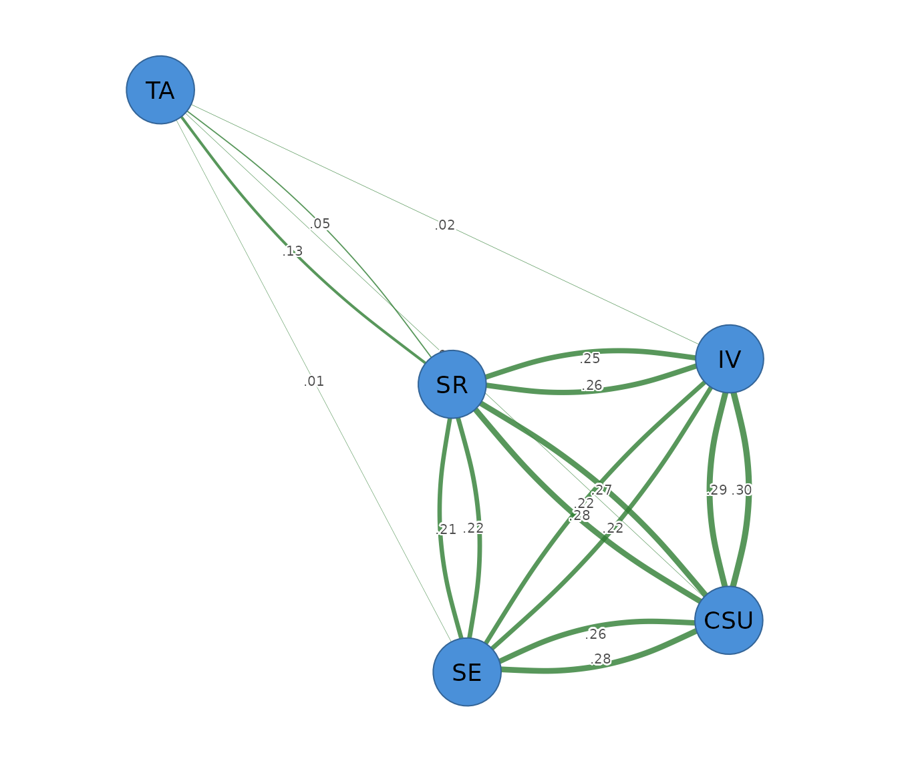

# Relative-importance networks

``` r

library(psychnets)
```

A **relative-importance network** (`method = "relimp"`) is **directed**.
For each node taken as an outcome, it regresses it on all the others and
decomposes that regression’s R-squared into each predictor’s share using
the **LMG / Shapley** method (averaging the predictor’s contribution
over every ordering). The edge `A -> B` is the share of B’s variance
explained by A. Unlike a GGM, the weights sum meaningfully: a node’s
incoming edges add up to its full-model R-squared.

The Shapley decomposition enumerates predictor subsets, so it is meant
for a modest number of nodes. We use the five construct scores in
`SRL_GPT`.

``` r

ri <- psychnet(SRL_GPT, method = "relimp")
ri
#> <psychnet> relimp network
#>   nodes: 5   edges: 20   (directed)
#>   optimality (KKT residual): 2.22e-16
```

The incoming shares per node sum to that node’s R-squared; the
certificate confirms this efficiency identity holds to numerical
precision:

``` r

certificate(ri)
#>   method  certificate       kind certified
#> 1 relimp 2.220446e-16 structural      TRUE
```

The directed edges – each predictor’s share of an outcome’s variance:

``` r

as.data.frame(ri)
#>    from  to      weight
#> 1    IV CSU 0.288505266
#> 2    SE CSU 0.263574096
#> 3    SR CSU 0.274082666
#> 4    TA CSU 0.007326148
#> 5   CSU  IV 0.299473895
#> 6    SE  IV 0.216286692
#> 7    SR  IV 0.258608009
#> 8    TA  IV 0.007032583
#> 9   CSU  SE 0.280588934
#> 10   IV  SE 0.219009605
#> 11   SR  SE 0.220573037
#> 12   TA  SE 0.006045547
#> 13  CSU  SR 0.277393999
#> 14   IV  SR 0.253052645
#> 15   SE  SR 0.212824511
#> 16   TA  SR 0.052422918
#> 17  CSU  TA 0.014154964
#> 18   IV  TA 0.015416846
#> 19   SE  TA 0.012055817
#> 20   SR  TA 0.127772080
```

Per-node explained variance that the incoming edges reconstruct:

``` r

net_predict(ri)
#>   node     type metric predictability accuracy
#> 1  CSU gaussian     R2      0.8334882       NA
#> 2   IV gaussian     R2      0.7814012       NA
#> 3   SE gaussian     R2      0.7262171       NA
#> 4   SR gaussian     R2      0.7956941       NA
#> 5   TA gaussian     R2      0.1693997       NA
```

## Plotting

[`cograph::splot()`](https://sonsoles.me/cograph/reference/splot.html)
draws the directed network with arrows. Because each pair has two
distinct edges (`A -> B` and `B -> A`), pass `directed = TRUE` so they
are drawn separately, with `psych_styling = TRUE` (green = positive, red
= negative) and the predictability ring via `predictability = TRUE`.

``` r

cograph::splot(ri, directed = TRUE, psych_styling = TRUE, predictability = TRUE)
```


