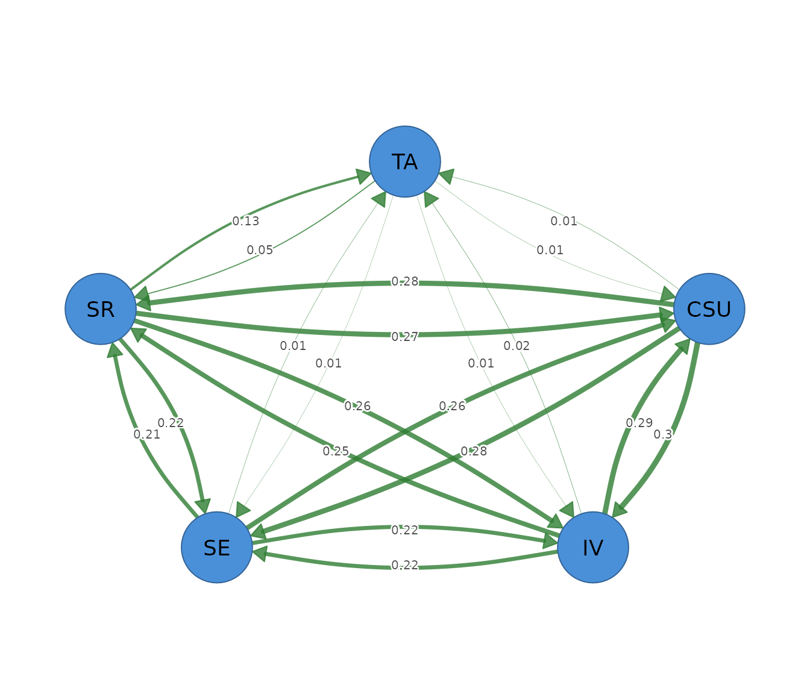

# Relative-importance networks

## What a relative-importance network is

A relative-importance network describes how much each variable
contributes to explaining every other variable. It fits a multiple
regression for each node, uses the remaining nodes as predictors, and
divides the model’s $`R^2`$ among those predictors. The resulting
contribution shares become directed edges.

Direction has a practical meaning. An edge from motivation to
achievement is the share of achievement’s explained variance attributed
to motivation after the other predictors have been considered. The
reverse edge is the share of motivation’s explained variance attributed
to achievement. These values can differ because each direction uses a
different outcome model.

The decomposition handles correlated predictors by averaging each
predictor’s increase in $`R^2`$ across all possible entry orders. A
predictor therefore receives a share of both its unique contribution and
the explanatory information it shares with other predictors. Incoming
edges sum to the outcome node’s full $`R^2`$, creating an interpretable
variance budget.

Relative-importance edges describe predictive attribution within linear
regressions. They do not identify causal effects, temporal direction, or
the change expected from an intervention.

## The data

The worked example uses `SRL_GPT`, which contains 300 observations on
cognitive strategy use (`CSU`), intrinsic value (`IV`), self-efficacy
(`SE`), self-regulation (`SR`), and test anxiety (`TA`). Each variable
is a continuous composite score on a 1 to 7 scale.

``` r

head(SRL_GPT)
#>        CSU       IV       SE       SR   TA
#> 1 5.307692 5.666667 5.777778 5.333333 4.00
#> 2 5.846154 6.444444 6.000000 5.777778 4.00
#> 3 6.615385 6.666667 6.222222 6.333333 3.25
#> 4 5.692308 6.555556 6.333333 5.555556 4.50
#> 5 4.384615 5.555556 4.888889 4.777778 4.00
#> 6 4.846154 5.444444 5.666667 5.111111 3.50
```

The data are complete, so every correlation uses all 300 observations.
The workflow assumes that linear regression is suitable for the
variables. A full analysis should inspect missingness, distributions,
unusual observations, linearity, and measurement quality.

## Fitting the network with `psychnet()`

[`psychnet()`](https://pak.dynasite.org/psychnets/reference/psychnet.md)
estimates a relative-importance network when `method = "relimp"`. It
returns a directed `psychnet` object containing the LMG importance
shares and the full-model $`R^2`$ for every node.

``` r

importance_net <- psychnet(data = SRL_GPT, method = "relimp")
importance_net
#> <psychnet> relimp network
#>   nodes: 5   edges: 20   (directed)
#>   optimality (KKT residual): 2.22e-16
```

The network contains 5 nodes and 20 directed edges, one for every
ordered pair of distinct nodes. Relative importance allocates a
contribution to every predictor, so the raw network is complete unless a
contribution is exactly zero.

## Inspecting directed contributions with `summary()`

[`summary()`](https://rdrr.io/r/base/summary.html) prints the fitted
network and returns an edge table with `from`, `to`, and `weight`. The
`from` node is the predictor, the `to` node is the outcome, and `weight`
is the predictor’s share of the outcome’s $`R^2`$.

``` r

summary(importance_net)
#> <psychnet> relimp network
#>   nodes: 5   edges: 20   (directed)
#>   optimality (KKT residual): 2.22e-16
#>   edge weight: range [0.006, 0.299], mean 0.165
```

The weights range from 0.006 to 0.299. The largest edge runs from `CSU`
to `IV` (0.299), meaning that cognitive strategy use receives 0.299 of
the variance explained in intrinsic value. The reverse `IV` to `CSU`
edge is 0.289. The two directions are similar here, but they are
separate regression contributions.

Self-regulation contributes 0.128 to the explained variance of test
anxiety. This is the largest incoming contribution to `TA`. The other
incoming shares are small: 0.014 from `CSU`, 0.015 from `IV`, and 0.012
from `SE`. These four shares sum to the full $`R^2`$ for test anxiety.

Edges pointing from test anxiety to the learning constructs are also
small, ranging from 0.006 to 0.052. Test anxiety therefore contributes
little to explaining those outcomes in the fitted regressions.

## Checking the decomposition with `certificate()`

[`certificate()`](https://pak.dynasite.org/psychnets/reference/certificate.md)
evaluates the efficiency identity of the relative-importance
decomposition. It returns `method`, `certificate`, `kind`, and
`certified`. The residual is the largest difference between a node’s
incoming edge sum and its full-model $`R^2`$.

``` r

certificate(importance_net)
#>   method  certificate       kind certified
#> 1 relimp 2.220446e-16 structural      TRUE
```

The residual is $`3.33 \times 10^{-16}`$ and `certified` is `TRUE`. This
value is at the order of machine precision. It indicates that the
incoming importance shares reconstruct every node’s $`R^2`$ to numerical
precision. The certificate checks the arithmetic identity, not the
adequacy or stability of the regression models.

## Reading incoming explanation with `net_predict()`

[`net_predict()`](https://pak.dynasite.org/psychnets/reference/net_predict.md)
reports each node’s full-model $`R^2`$. The returned table contains
`node`, `type`, `metric`, `predictability`, and `accuracy`. Gaussian
nodes use `metric = "R2"`, and classification accuracy does not apply.

``` r

net_predict(importance_net)
#>   node     type metric predictability accuracy
#> 1  CSU gaussian     R2      0.8334882       NA
#> 2   IV gaussian     R2      0.7814012       NA
#> 3   SE gaussian     R2      0.7262171       NA
#> 4   SR gaussian     R2      0.7956941       NA
#> 5   TA gaussian     R2      0.1693997       NA
```

Cognitive strategy use has $`R^2 = 0.833`$, self-regulation has 0.796,
intrinsic value has 0.781, and self-efficacy has 0.726. The other four
constructs account for a large proportion of each learning construct’s
variance.

Test anxiety has $`R^2 = 0.169`$. Its four incoming importance shares
therefore form a much smaller variance budget. Most variation in test
anxiety remains outside this five-variable linear model.

## Reading outgoing contribution with `net_centralities()`

[`net_centralities()`](https://pak.dynasite.org/psychnets/reference/net_centralities.md)
sums outgoing edges for a directed relative-importance network. Its
default table contains `node`, `strength`, and `expected_influence`. All
LMG shares are non-negative, so strength and expected influence are
equal.

``` r

net_centralities(importance_net)
#>   node  strength expected_influence
#> 1  CSU 0.8716118          0.8716118
#> 2   IV 0.7759844          0.7759844
#> 3   SE 0.7047411          0.7047411
#> 4   SR 0.8810358          0.8810358
#> 5   TA 0.0728272          0.0728272
```

Self-regulation has the largest outgoing total (0.881), followed by
cognitive strategy use (0.872). Across the four regressions where it is
a predictor, self-regulation receives the greatest total attributed
contribution. Test anxiety has the smallest outgoing total (0.073).

The two node tables answer different questions.
[`net_predict()`](https://pak.dynasite.org/psychnets/reference/net_predict.md)
summarizes incoming explanation, which is how well a node is explained
by the others.
[`net_centralities()`](https://pak.dynasite.org/psychnets/reference/net_centralities.md)
summarizes outgoing contribution, which is how much a node contributes
to explaining the other outcomes.

## Visualizing direction with `cograph::splot()`

[`cograph::splot()`](https://sonsoles.me/cograph/reference/splot.html)
draws the fitted network when the optional `cograph` package is
available. The argument `directed = TRUE` displays arrowheads, and
`edge_labels = TRUE` prints the importance shares on the edges.

``` r

cograph::splot(importance_net, directed = TRUE, edge_labels = TRUE)
```



The plot is dense because all ordered pairs have a contribution. Edge
direction and width aid orientation, but the edge table is the primary
result for exact interpretation. Node distances from the layout have no
statistical scale.

## Sensitivity to rank correlations

[`psychnet()`](https://pak.dynasite.org/psychnets/reference/psychnet.md)
accepts `cor_method = "spearman"` for a rank-based sensitivity analysis.
This analysis evaluates whether the attribution pattern persists when
the regression decomposition is based on monotonic rank associations.

``` r

importance_spearman <- psychnet(data = SRL_GPT, method = "relimp", cor_method = "spearman")
importance_spearman
#> <psychnet> relimp network
#>   nodes: 5   edges: 20   (directed)
#>   optimality (KKT residual): 2.22e-16
```

``` r

summary(importance_spearman)
#> <psychnet> relimp network
#>   nodes: 5   edges: 20   (directed)
#>   optimality (KKT residual): 2.22e-16
#>   edge weight: range [0.004, 0.299], mean 0.160
```

The largest rank-based edge remains `CSU` to `IV` at 0.299. The learning
constructs retain substantial contributions to one another. The
contribution from self-regulation to test anxiety decreases from 0.128
to 0.086, and the other test-anxiety contributions remain small.

``` r

net_predict(importance_spearman)
#>   node     type metric predictability accuracy
#> 1  CSU gaussian     R2      0.8276988       NA
#> 2   IV gaussian     R2      0.7714652       NA
#> 3   SE gaussian     R2      0.7123679       NA
#> 4   SR gaussian     R2      0.7723157       NA
#> 5   TA gaussian     R2      0.1156386       NA
```

The rank-based $`R^2`$ for test anxiety is 0.116, compared with 0.169 in
the Pearson analysis. The four learning constructs retain $`R^2`$ values
from 0.712 to 0.828. The main learning-construct pattern persists, while
the explanation of test anxiety is sensitive to the correlation
estimator.

## Reporting the analysis

A report should state the variables, sample size, correlation estimator,
missing-data procedure, whether raw or normalized shares were used, and
the LMG decomposition. Each edge must identify its predictor and outcome
direction. Incoming $`R^2`$ and outgoing contribution should be reported
as distinct node summaries.

The present analysis used raw LMG shares based on Pearson correlations
from 300 complete observations. The network contained 20 directed edges.
The largest edge ran from cognitive strategy use to intrinsic value
(0.299). The incoming shares reconstructed every node’s $`R^2`$ with a
maximum residual of $`3.33 \times 10^{-16}`$. A Spearman sensitivity
analysis preserved the main learning-construct pattern but reduced the
variance explained in test anxiety.

## How relative importance is computed

For each outcome, the method considers every subset of the remaining
predictors. It measures how much the model’s $`R^2`$ increases when a
predictor is added to each subset and averages those increases with
weights that represent all possible predictor orders. This average is
the predictor’s LMG share.

The shares are non-negative and sum to the full-model $`R^2`$. Raw
shares retain that variance scale. Setting `normalized = TRUE` rescales
the incoming shares of each outcome to sum to 1, which expresses
relative proportions within the outcome’s explained variance.
Normalization changes the reporting scale and does not change the
underlying full-model $`R^2`$.

The method evaluates $`2^{p-1}`$ predictor subsets for each outcome, so
computation grows rapidly with the number of nodes.
[`relimp_network()`](https://pak.dynasite.org/psychnets/reference/relimp_network.md)
uses a default limit of 21 nodes.

## Mathematical foundations

For outcome $`j`$ and predictor set $`P`$, the LMG share of predictor
$`k`$ is

``` math
\varphi_{kj}
=\sum_{S\subseteq P\setminus\{k\}}
\frac{|S|!(|P|-|S|-1)!}{|P|!}
\left[R^2(S\cup\{k\})-R^2(S)\right].
```

For a subset $`A`$, its regression $`R^2`$ is computed from correlation
matrix $`\mathbf{S}`$ as

``` math
R^2(A)=\mathbf{S}_{jA}\mathbf{S}_{AA}^{-1}\mathbf{S}_{Aj}.
```

The efficiency identity is

``` math
\sum_k\varphi_{kj}=R_j^2.
```

The directed weight matrix has $`W_{kj}=\varphi_{kj}`$. Column sums are
incoming $`R^2`$ values reported by
[`net_predict()`](https://pak.dynasite.org/psychnets/reference/net_predict.md).
Row sums are outgoing contributions reported by
[`net_centralities()`](https://pak.dynasite.org/psychnets/reference/net_centralities.md).
[`certificate()`](https://pak.dynasite.org/psychnets/reference/certificate.md)
returns the maximum absolute deviation from the efficiency identity
across nodes.
