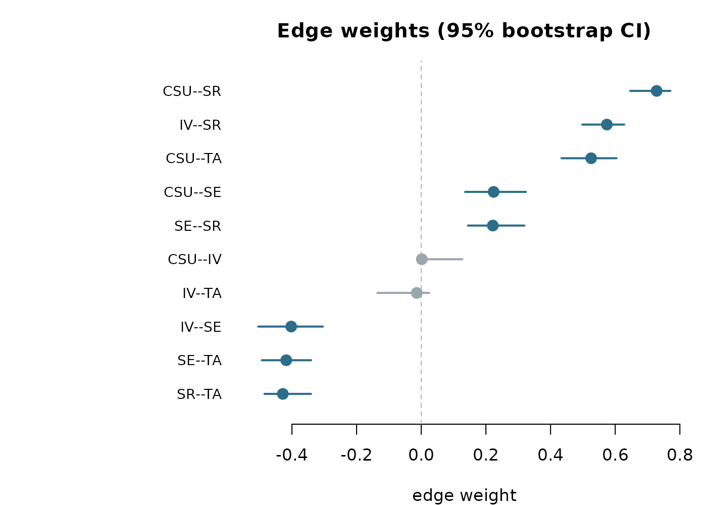
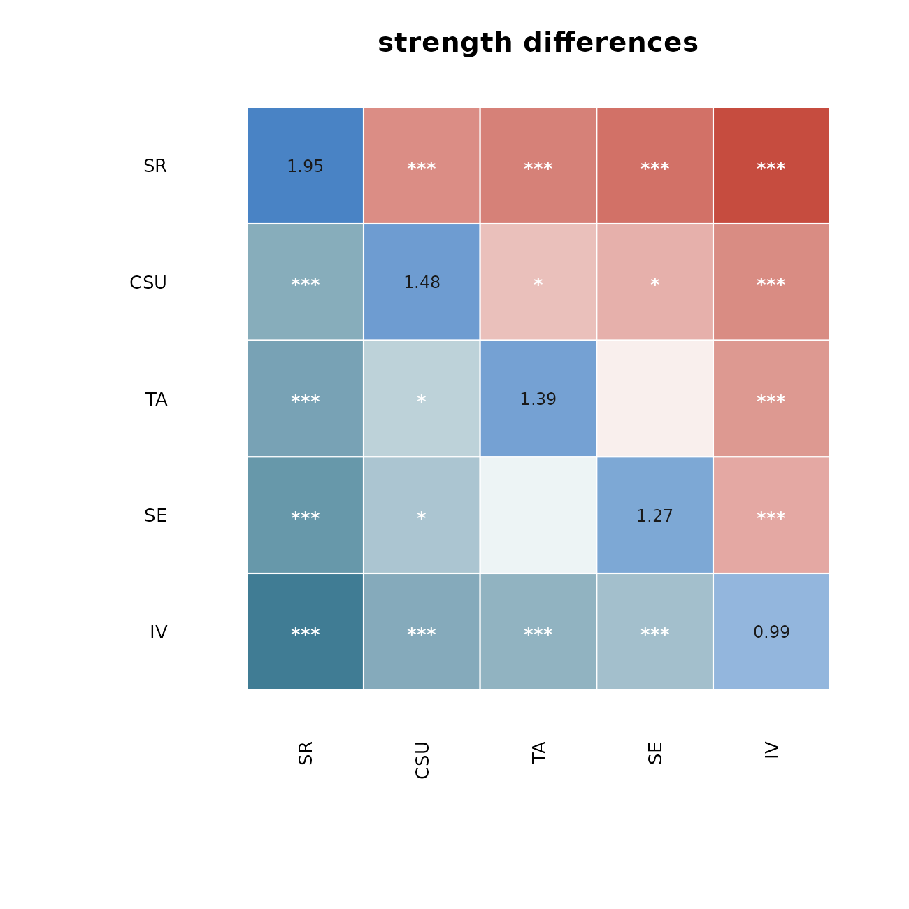

# Visualizing bootstrap, centrality and difference results (base R)

`psychnets` ships **native base-R plot methods** for every diagnostic
verb, so you can inspect a model’s stability and structure with no
additional packages (`graphics` and `grDevices` ship with R). This
vignette walks through them on the bundled `SRL_Claude`
self-regulated-learning data (300 respondents, five MSLQ subscales). A
companion vignette, *“Visualizing networks with cograph”*, shows the
richer cograph renderings of the same results.

Every plot is an S3
[`plot()`](https://rdrr.io/r/graphics/plot.default.html) method on a
result object — call
[`plot()`](https://rdrr.io/r/graphics/plot.default.html) on what a verb
returns; there is no bracket-subsetting to assemble.

## Estimate a network

``` r

X   <- as.matrix(SRL_Claude)
fit <- ebic_glasso(X)
fit
#> <psychnet> glasso network
#>   nodes: 5   edges: 10   (undirected)
#>   lambda: 0.009013   gamma: 0.5
#>   optimality (KKT residual): 3.92e-10
```

## Centralities

[`net_centralities()`](https://pak.dynasite.org/psychnets/reference/net_centralities.md)
returns a tidy table;
[`plot()`](https://rdrr.io/r/graphics/plot.default.html) draws it.

``` r

ct <- net_centralities(fit, measures = c("strength", "expected_influence", "betweenness"))
ct
#>   node  strength expected_influence betweenness
#> 1  CSU 1.4794795          1.4794795   0.0000000
#> 2   IV 0.9920086          0.1598207   0.3333333
#> 3   SE 1.2652845         -0.3743445   0.0000000
#> 4   SR 1.9520259          1.0956629   0.6666667
#> 5   TA 1.3851959         -0.3340278   0.3333333
```

`type = "bar"` (the default) gives one sorted lollipop panel per
measure:

``` r

plot(ct)
```


`type = "line"` gives the qgraph-style faceted centrality plot — one
panel per measure, nodes sharing a single vertical order, each panel on
its own (raw) axis:

``` r

plot(ct, type = "line")
```


Use `scale = "z"` or `scale = "relative"` if you prefer a standardised
or a 0–1 axis instead of raw values.

## Bootstrap accuracy

[`net_boot()`](https://pak.dynasite.org/psychnets/reference/net_boot.md)
resamples and re-estimates;
[`plot()`](https://rdrr.io/r/graphics/plot.default.html) defaults to the
edge-weight confidence intervals, sorted by the observed weight (edges
whose interval excludes zero are emphasised).

``` r

set.seed(1)
bs <- net_boot(X, method = "glasso", n_boot = 250, cores = 1)
plot(bs)
```



Bootstrapped centrality intervals, one panel per measure:

``` r

plot(bs, type = "centrality")
```


The bootstrapped difference “significance box” matrices — which edges,
or which node strengths, differ from one another:

``` r

plot(bs, type = "edge_diff")
```


``` r

plot(bs, type = "centrality_diff", measure = "strength")
```


## Difference test

[`difference_test()`](https://pak.dynasite.org/psychnets/reference/difference_test.md)
is the tidy table of pairwise differences. Its
[`plot()`](https://rdrr.io/r/graphics/plot.default.html) has two styles:
the significance-box matrix (`"box"`, the default) for *which* pairs
differ, and a forest plot (`"forest"`) for *how big* each difference is
with its confidence interval.

``` r

dt <- difference_test(bs, type = "strength")
plot(dt)                       # box matrix
```



``` r

plot(dt, style = "forest")     # forest plot
```


## Case-dropping stability

[`net_stability()`](https://pak.dynasite.org/psychnets/reference/net_stability.md)
drops increasing fractions of cases and correlates the subset
centralities with the full-sample ones;
[`plot()`](https://rdrr.io/r/graphics/plot.default.html) shows the
curves, a ±1 SD band, the acceptance threshold, and the CS-coefficient
per measure.

``` r

st <- net_stability(X, method = "glasso",
                    drop_prop = seq(0.1, 0.8, 0.1), iter = 25)
plot(st)
```


## Network comparison test

[`net_compare()`](https://pak.dynasite.org/psychnets/reference/net_compare.md)
permutation-tests two networks. Plot the global-strength (M) and
structure (S) permutation nulls, or the per-edge differences.

``` r

cmp <- net_compare(X, as.matrix(SRL_GPT), iter = 250)
plot(cmp)                      # global strength (M)
```


``` r

plot(cmp, type = "edges")      # per-edge differences
```


## Summary

| Result object (verb) | [`plot()`](https://rdrr.io/r/graphics/plot.default.html) options |
|----|----|
| [`net_centralities()`](https://pak.dynasite.org/psychnets/reference/net_centralities.md) | `type = "bar"` / `"line"`; `scale = "raw"`/`"z"`/`"relative"` |
| [`net_boot()`](https://pak.dynasite.org/psychnets/reference/net_boot.md) | `type = "edges"`/`"centrality"`/`"edge_diff"`/`"centrality_diff"`/`"predictability"` |
| [`difference_test()`](https://pak.dynasite.org/psychnets/reference/difference_test.md) | `style = "box"`/`"forest"` |
| [`net_stability()`](https://pak.dynasite.org/psychnets/reference/net_stability.md) | — |
| [`net_compare()`](https://pak.dynasite.org/psychnets/reference/net_compare.md) | `type = "strength"`/`"structure"`/`"edges"` |

All of the above use only base R. For the estimated network itself,
`plot(fit)` delegates to
[`cograph::splot()`](https://sonsoles.me/cograph/reference/splot.html) —
see the companion cograph vignette.
