# Visualizing bootstrap, centrality and difference results (base R)

## Network diagnostics

## Plotting networks and diagnostic results

*psychnets* provides a comprehensive set of visualization methods for
estimated psychometric networks and their associated diagnostic
analyses, facilitating both interpretation and statistical assessment.
In addition to graphical displays, all estimation and diagnostic
functions return tidy result objects that can be inspected
programmatically, summarized numerically, or incorporated into
downstream analytical workflows.

Psychometric networks are estimated from finite samples, and
consequently every estimated edge weight, centrality measure, and
derived statistic is subject to sampling variability. The diagnostic
procedures implemented in *psychnets* quantify this uncertainty using
non-parametric bootstrap resampling, case-dropping resampling, and
permutation-based hypothesis testing. Each diagnostic returns a
structured result object containing both the numerical results and the
information required for graphical representation.

All graphical output is generated through dedicated
[`plot()`](https://rdrr.io/r/graphics/plot.default.html) methods
implemented for the corresponding result classes. These methods rely
exclusively on the base R **graphics** and **grDevices** systems and
therefore require no external visualization libraries. Throughout this
tutorial, each figure is produced by fitting a network, applying a
diagnostic procedure, and calling
[`plot()`](https://rdrr.io/r/graphics/plot.default.html) on the returned
object. The following sections describe the interpretation of the
principal visualizations, including network plots, centrality measures,
bootstrap confidence intervals, difference matrices, pairwise difference
tests, case-dropping stability curves, and network comparison tests.

## The data

The bundled `SRL_GPT` data hold responses from 300 learners on five
self-regulated-learning constructs (CSU, IV, SE, SR, TA), each a
continuous subscale score.

``` r

head(SRL_GPT)
#>        CSU       IV       SE       SR   TA
#> 1 5.307692 5.666667 5.777778 5.333333 4.00
#> 2 5.846154 6.444444 6.000000 5.777778 4.00
#> 3 6.615385 6.666667 6.222222 6.333333 3.25
#> 4 5.692308 6.555556 6.333333 5.555556 4.50
#> 5 4.384615 5.555556 4.888889 4.777778 4.00
#> 6 4.846154 5.444444 5.666667 5.111111 3.50
```

## Estimate a network

[`ebic_glasso()`](https://pak.dynasite.org/psychnets/reference/ebic_glasso.md)
estimates a Gaussian graphical model whose edges are partial
correlations selected by the extended Bayesian information criterion.
The fitted object is the input to every diagnostic below.

``` r

fit <- ebic_glasso(SRL_GPT)
fit
#> <psychnet> glasso network
#>   nodes: 5   edges: 10   (undirected)
#>   lambda: 0.00861   gamma: 0.5
#>   optimality (KKT residual): 2.21e-10
```

## Centralities

[`net_centralities()`](https://pak.dynasite.org/psychnets/reference/net_centralities.md)
computes node centrality measures from the fitted network and returns a
tidy table with one row per node and one column per measure. Strength is
the sum of absolute edge weights at a node, expected influence is the
sum of signed edge weights, and betweenness counts the weighted shortest
paths that pass through a node.

``` r

ct <- net_centralities(fit, measures = c("strength", "expected_influence", "betweenness"))
ct
#>   node  strength expected_influence betweenness
#> 1  CSU 1.1984512         1.19845117   0.3333333
#> 2   IV 1.0012765         1.00127649   0.0000000
#> 3   SE 0.8492185         0.84921854   0.0000000
#> 4   SR 1.2314317         0.53172852   1.0000000
#> 5   TA 0.6082238        -0.09147935   0.0000000
```

[`plot()`](https://rdrr.io/r/graphics/plot.default.html) for a
`psychnet_centrality` table draws one panel per measure. Under the
default `type = "bar"`, each panel is a horizontal lollipop chart whose
nodes are sorted by their value, so the most central node sits at the
top of the panel and the length of each segment reads directly as the
centrality value.

``` r

plot(ct)
```

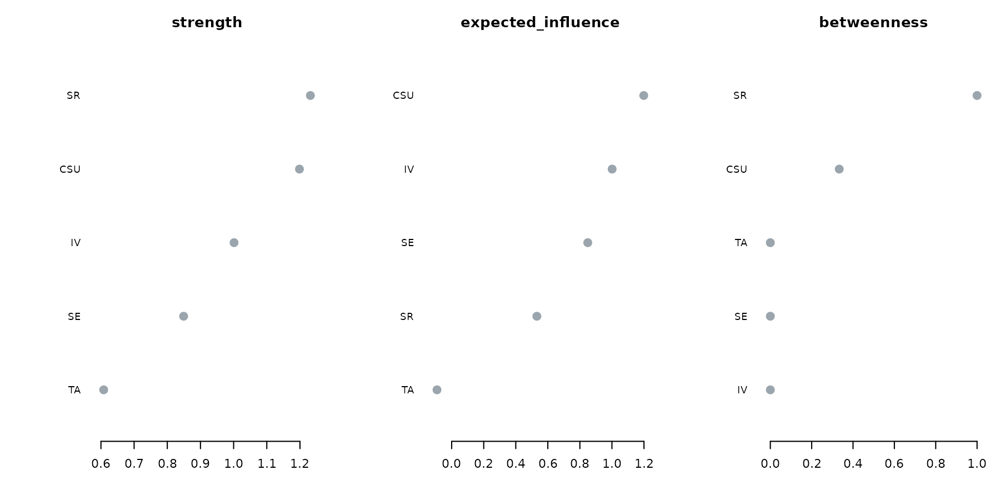

Under `type = "line"`,
[`plot()`](https://rdrr.io/r/graphics/plot.default.html) draws the
faceted centrality profile. The nodes share a single vertical order
across all panels, set by their mean standardized centrality, and each
panel keeps its own horizontal axis. A node that sits high in every
panel is central on every measure; a node whose position shifts between
panels is central on one measure and peripheral on another.

``` r

plot(ct, type = "line")
```

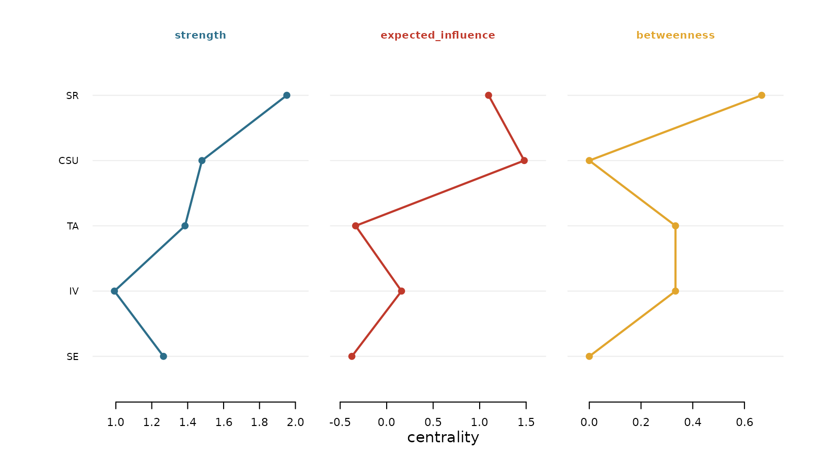

The `scale` argument controls the per-panel transform in the line view.
The default `"raw"` keeps each panel on its own axis of centrality
values, `"z"` centres each measure at its mean and scales it to unit
standard deviation, and `"relative"` maps each measure to the interval
from zero to one.

``` r

plot(ct, type = "line", scale = "z")
```

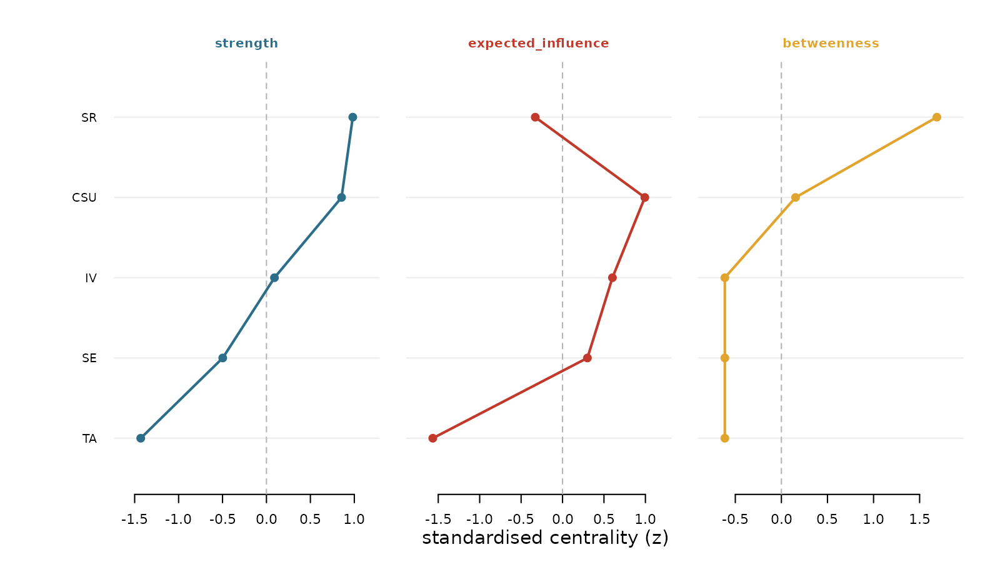

## Bootstrap accuracy

[`net_boot()`](https://pak.dynasite.org/psychnets/reference/net_boot.md)
resamples the rows of the data with replacement, refits the network on
each resample, and records the distribution of every edge weight and
every centrality value across resamples. The percentile confidence
interval of each quantity is the reported measure of its sampling
accuracy.

``` r

set.seed(1)
bs <- net_boot(SRL_GPT, method = "glasso", n_boot = 250, cores = 1)
```

[`plot()`](https://rdrr.io/r/graphics/plot.default.html) for a
`psychnet_bootstrap` object defaults to `type = "edges"`, the
edge-accuracy plot. Each row is an edge, sorted by its observed weight;
the point is the observed weight and the segment is its bootstrap
confidence interval. An edge whose interval excludes zero is drawn in
the emphasis colour, which reports that the edge is present across
resamples; an edge whose interval crosses zero is muted.

``` r

plot(bs)
```

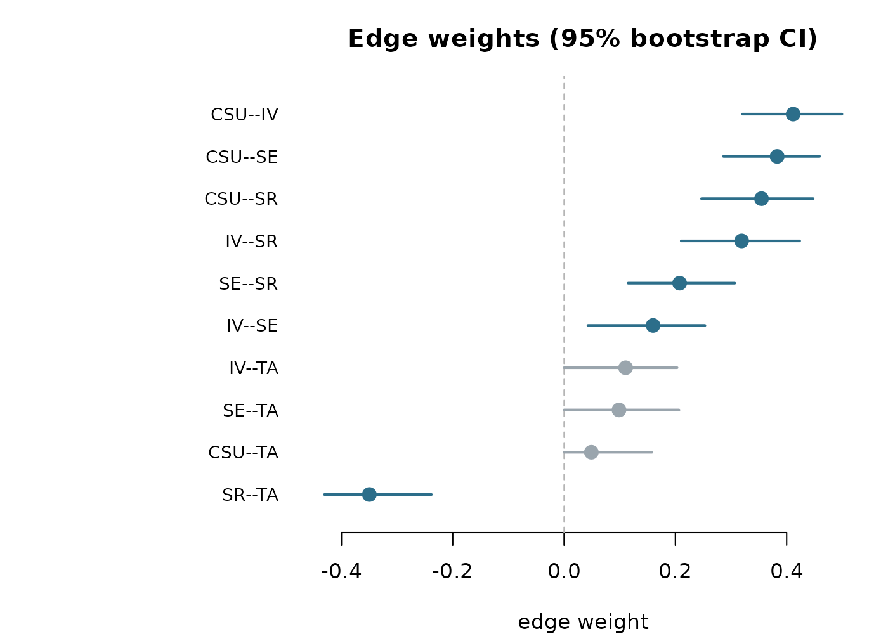

Under `type = "centrality"`,
[`plot()`](https://rdrr.io/r/graphics/plot.default.html) draws the
bootstrapped centrality intervals, one sorted panel per measure. A node
whose interval is wide relative to the spread across nodes is estimated
with low precision, so its rank among the nodes is uncertain.

``` r

plot(bs, type = "centrality")
```

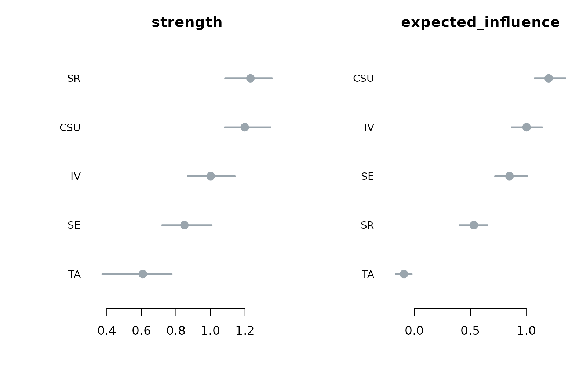

Under `type = "edge_diff"` and `type = "centrality_diff"`,
[`plot()`](https://rdrr.io/r/graphics/plot.default.html) draws the
difference “significance box” matrix. The items sit on both axes,
ordered by their observed value from high to low. The diagonal carries
the observed value, shaded by its magnitude. An off-diagonal cell is
filled when that pair of items differs across the bootstrap, coloured
red when the row item is larger than the column item and blue when it is
smaller, and it is left faint when the pair does not differ. The stars
report the difference p-value.

``` r

plot(bs, type = "edge_diff")
```

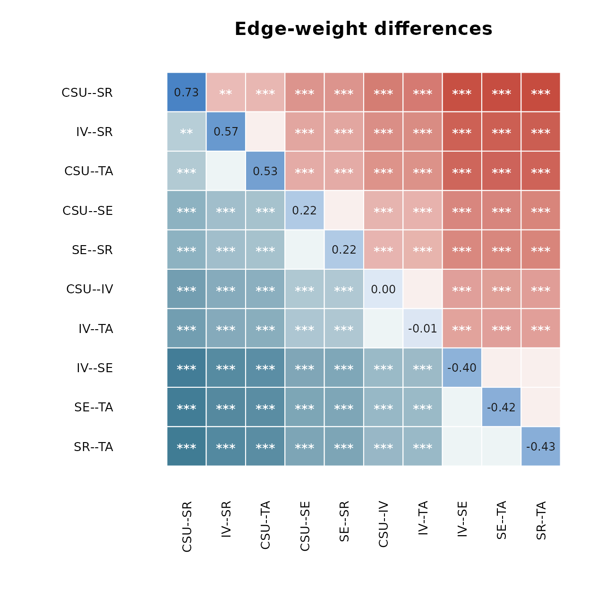

``` r

plot(bs, type = "centrality_diff", measure = "strength")
```

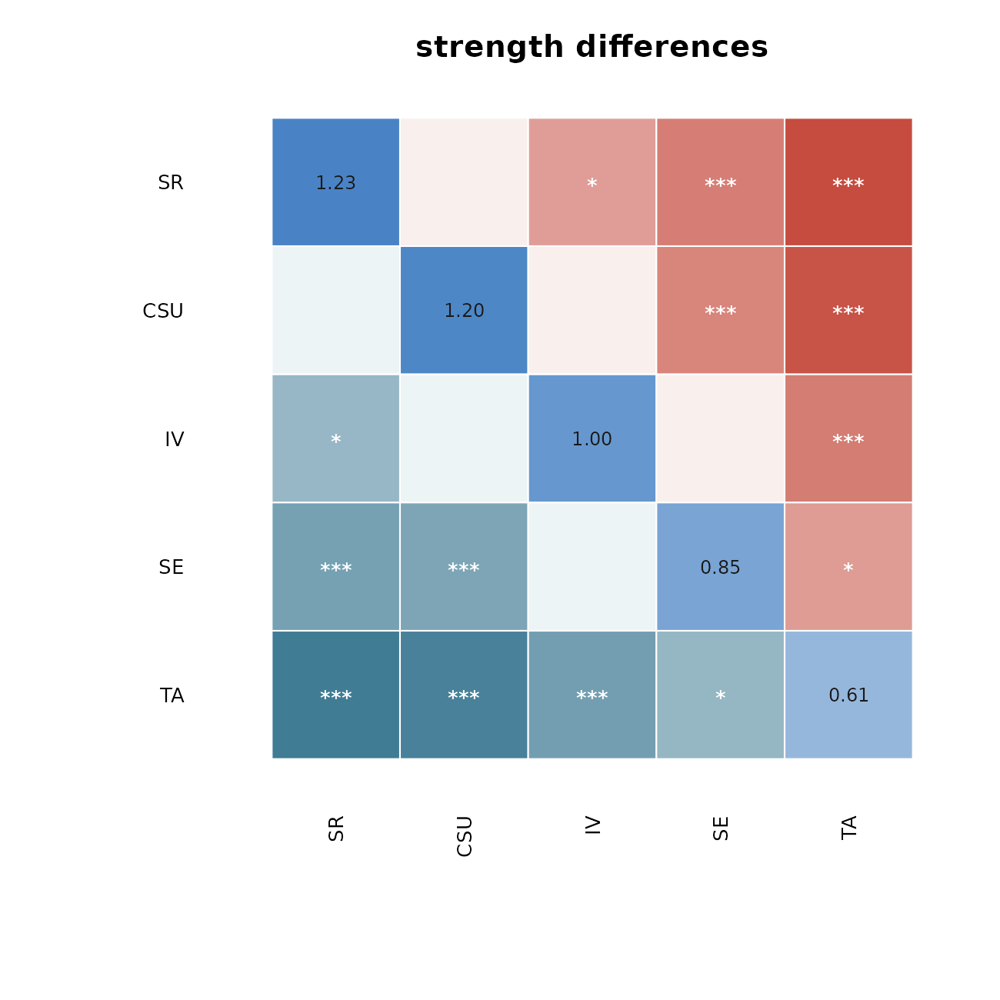

## Difference test

[`difference_test()`](https://pak.dynasite.org/psychnets/reference/difference_test.md)
reads the retained bootstrap draws and returns a tidy table of pairwise
differences, with columns `item1`, `item2`, the two observed values, the
observed difference `obs_diff`, its interval `lower` and `upper`, the
`p_value`, and a `significant` flag set when the interval excludes zero.

``` r

dt <- difference_test(bs, type = "strength")
head(dt)
#>   item1 item2    value1    value2    obs_diff       lower       upper p_value
#> 1   CSU    IV 1.1984512 1.0012765  0.19717467 -0.01516075  0.43862886   0.080
#> 2   CSU    SE 1.1984512 0.8492185  0.34923263  0.12605796  0.63527516   0.000
#> 3    IV    SE 1.0012765 0.8492185  0.15205795 -0.09197932  0.36727209   0.208
#> 4   CSU    SR 1.1984512 1.2314317 -0.03298049 -0.21134715  0.18144546   0.712
#> 5    IV    SR 1.0012765 1.2314317 -0.23015517 -0.41550510 -0.04600301   0.024
#> 6    SE    SR 0.8492185 1.2314317 -0.38221312 -0.54711539 -0.20825524   0.000
#>   significant
#> 1       FALSE
#> 2        TRUE
#> 3       FALSE
#> 4       FALSE
#> 5        TRUE
#> 6        TRUE
```

[`plot()`](https://rdrr.io/r/graphics/plot.default.html) for a
`psychnet_difference` table has two styles. The default `style = "box"`
draws the same significance-box matrix as above, which reads *which*
pairs differ.

``` r

plot(dt)
```


Under `style = "forest"`,
[`plot()`](https://rdrr.io/r/graphics/plot.default.html) draws a forest
plot with one row per pair. The point is the observed difference, the
segment is its confidence interval, the dashed line marks zero, and a
pair whose interval excludes zero is emphasised. This view reads *how
large* each difference is together with its uncertainty.

``` r

plot(dt, style = "forest")
```

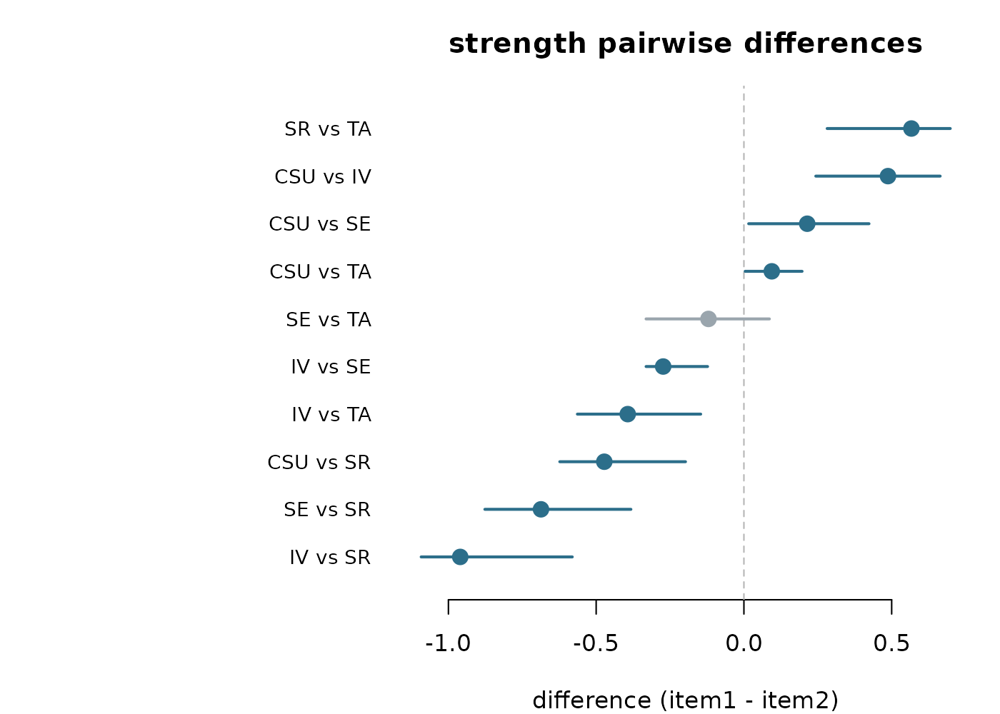

## Case-dropping stability

[`net_stability()`](https://pak.dynasite.org/psychnets/reference/net_stability.md)
drops an increasing fraction of the cases, refits the network on each
subset, and correlates the subset centralities with the full-sample
centralities. The case-dropping (CS) coefficient is the largest drop
proportion at which the correlation stays above the acceptance threshold
with the stated certainty.

``` r

st <- net_stability(SRL_GPT, method = "glasso",
                    drop_prop = seq(0.1, 0.8, 0.1), iter = 25)
```

[`plot()`](https://rdrr.io/r/graphics/plot.default.html) for a
`psychnet_stability` object draws the stability curves. The horizontal
axis is the proportion of cases dropped and the vertical axis is the
mean correlation with the full sample. Each measure is a line with a
band of plus or minus one standard deviation, the dashed line is the
acceptance threshold, and the legend reports the CS-coefficient for each
measure. A curve that stays above the threshold as more cases are
dropped indicates a stable centrality ordering.

``` r

plot(st)
```

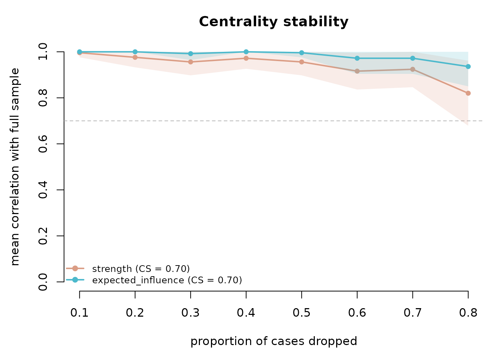

## Network comparison test

[`net_compare()`](https://pak.dynasite.org/psychnets/reference/net_compare.md)
compares two networks by permutation. It repeatedly reassigns the pooled
cases to two groups at random, recomputes the test statistic on each
permutation, and builds the distribution of that statistic expected when
the two networks do not differ. The global strength statistic (M) is the
difference in summed absolute edge weights, and the structure statistic
(S) is the maximum absolute edge difference.

``` r

cmp <- net_compare(SRL_GPT, SRL_Claude, iter = 250)
```

[`plot()`](https://rdrr.io/r/graphics/plot.default.html) for a
`psychnet_nct` object defaults to `type = "strength"`, the permutation
null for M. The histogram is the null distribution, the red line marks
the observed value, and the title reports the permutation p-value. An
observed value in the tail of the null provides evidence that the two
networks differ in global strength.

``` r

plot(cmp)
```

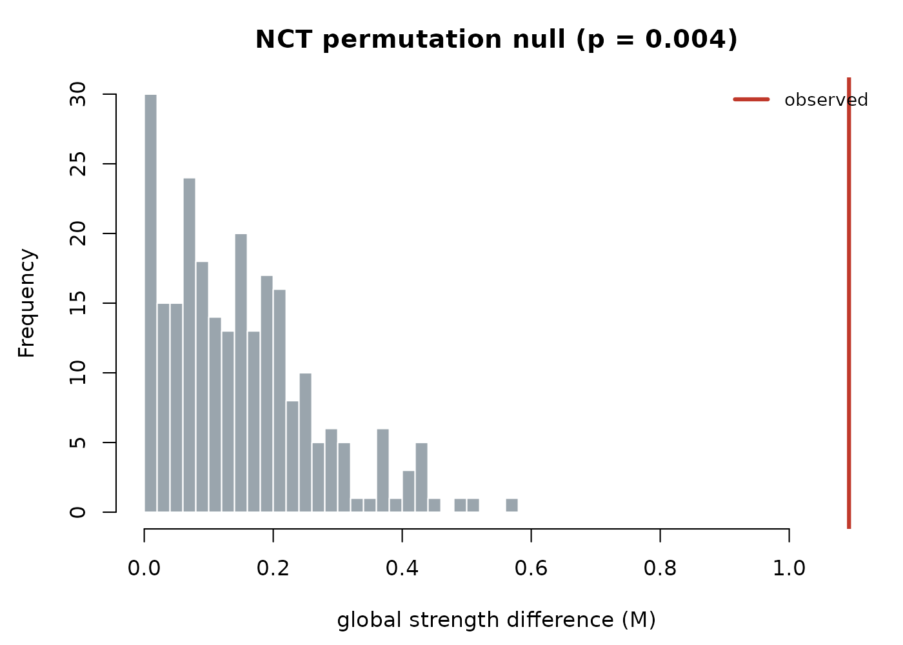

Under `type = "structure"`,
[`plot()`](https://rdrr.io/r/graphics/plot.default.html) draws the same
null for the maximum edge-difference statistic S.

``` r

plot(cmp, type = "structure")
```

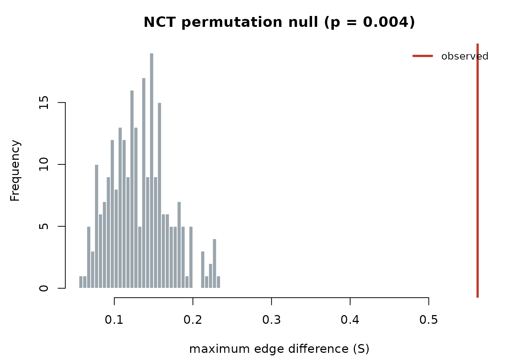

Under `type = "edges"`,
[`plot()`](https://rdrr.io/r/graphics/plot.default.html) draws the
observed absolute difference of each edge as a horizontal bar, coloured
by whether that edge differs significantly at the level set by `alpha`.
The title reports how many edges reach significance.

``` r

plot(cmp, type = "edges")
```

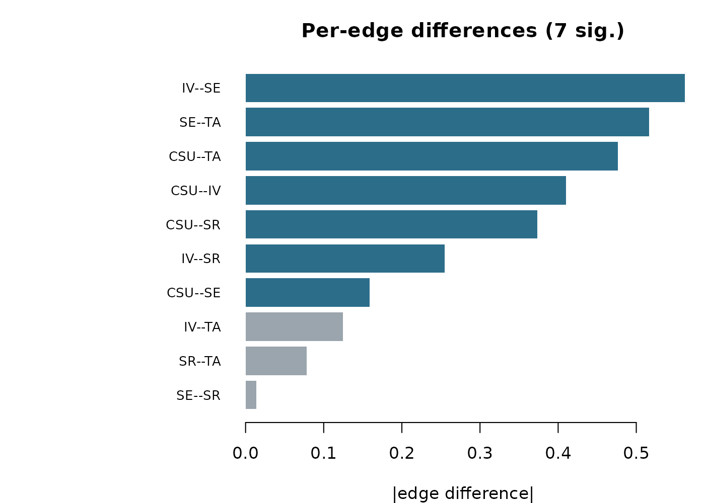

## The plot methods at a glance

| Result object (verb) | [`plot()`](https://rdrr.io/r/graphics/plot.default.html) options |
|----|----|
| [`net_centralities()`](https://pak.dynasite.org/psychnets/reference/net_centralities.md) | `type = "bar"` / `"line"`; `scale = "raw"` / `"z"` / `"relative"` |
| [`net_boot()`](https://pak.dynasite.org/psychnets/reference/net_boot.md) | `type = "edges"` / `"centrality"` / `"edge_diff"` / `"centrality_diff"` / `"predictability"` |
| [`difference_test()`](https://pak.dynasite.org/psychnets/reference/difference_test.md) | `style = "box"` / `"forest"` |
| [`net_stability()`](https://pak.dynasite.org/psychnets/reference/net_stability.md) | one figure |
| [`net_compare()`](https://pak.dynasite.org/psychnets/reference/net_compare.md) | `type = "strength"` / `"structure"` / `"edges"` |

Each figure above is drawn with base R alone. For the estimated network
itself, `plot(fit)` delegates to
[`cograph::splot()`](https://sonsoles.me/cograph/reference/splot.html),
covered in the companion vignette *Visualizing networks with cograph*.
