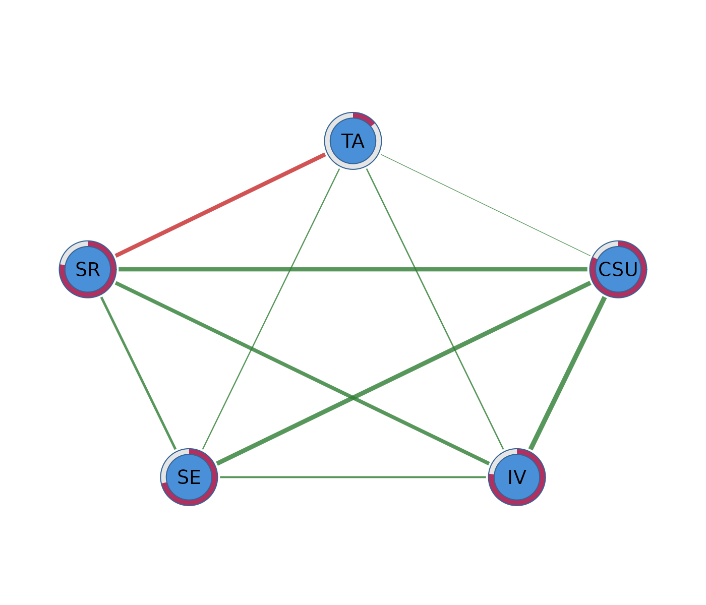
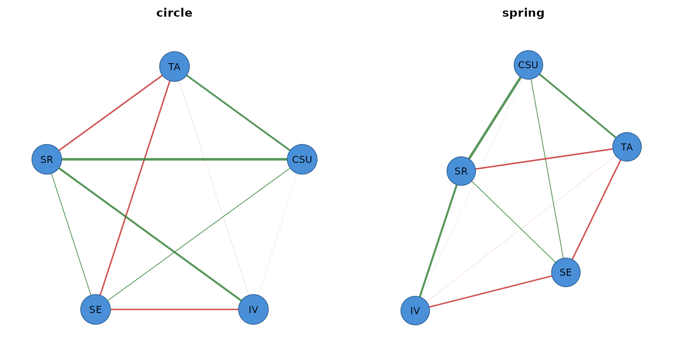
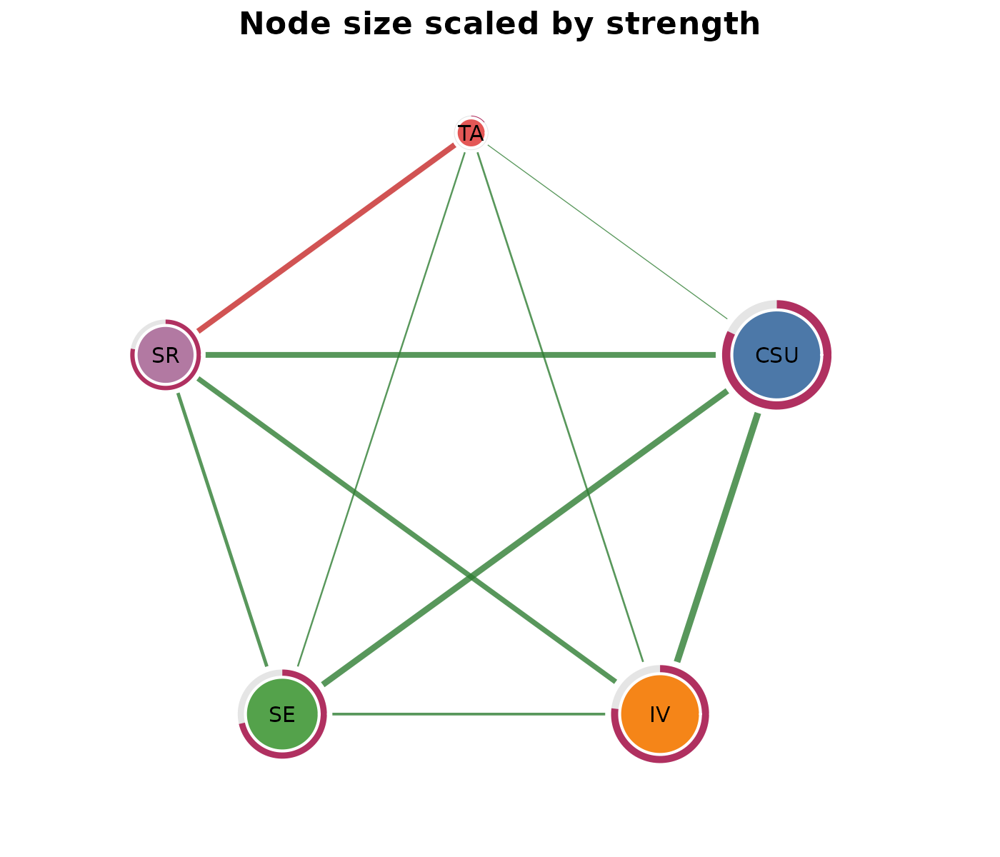
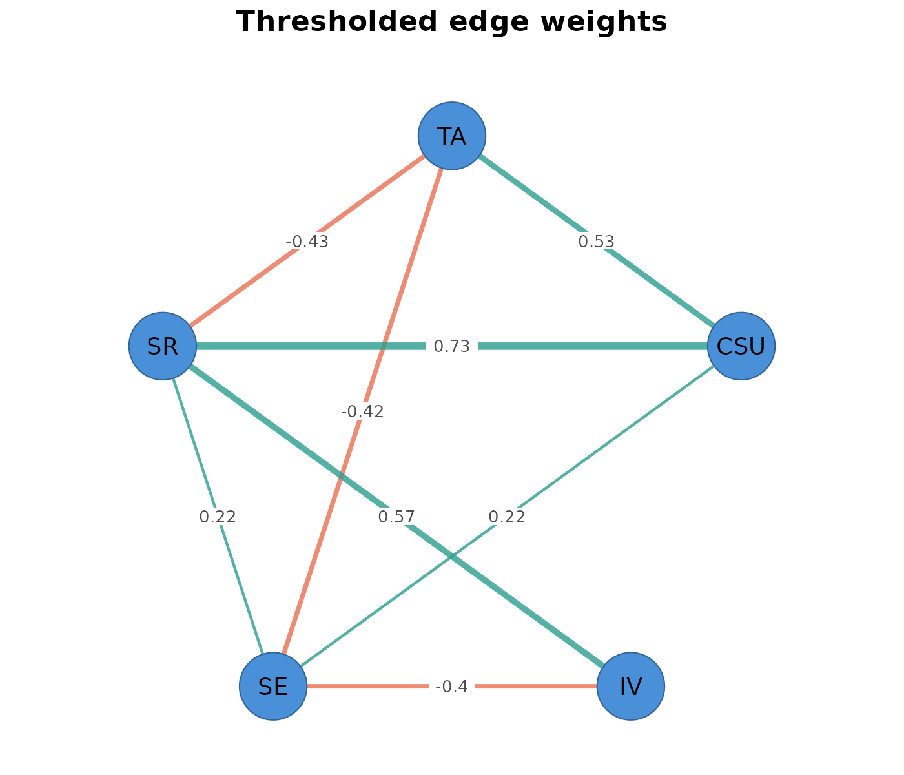
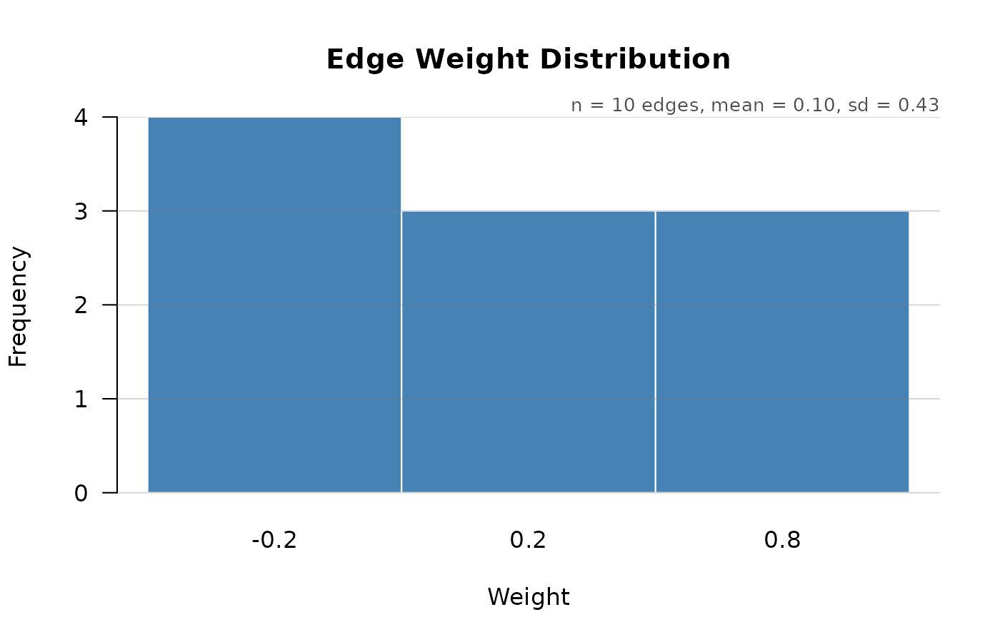
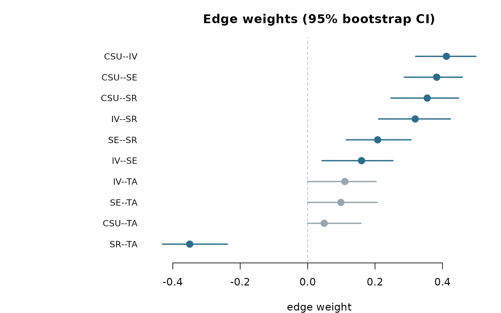
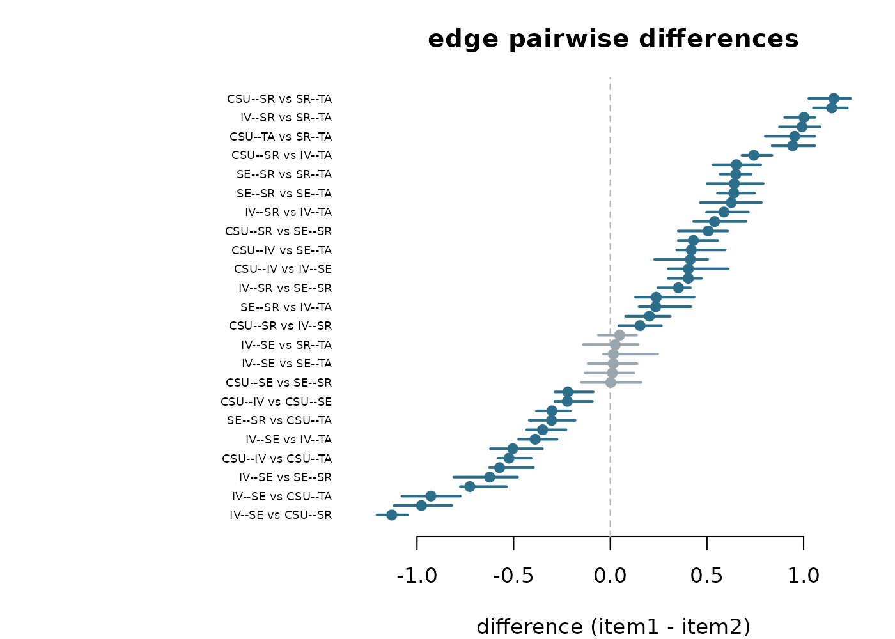
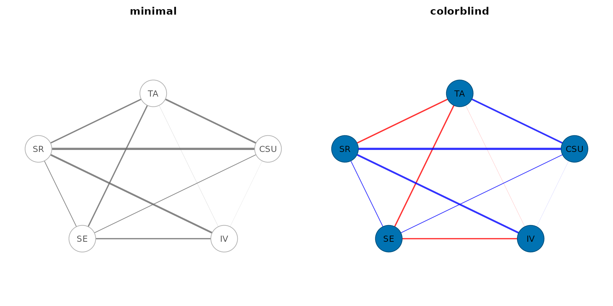
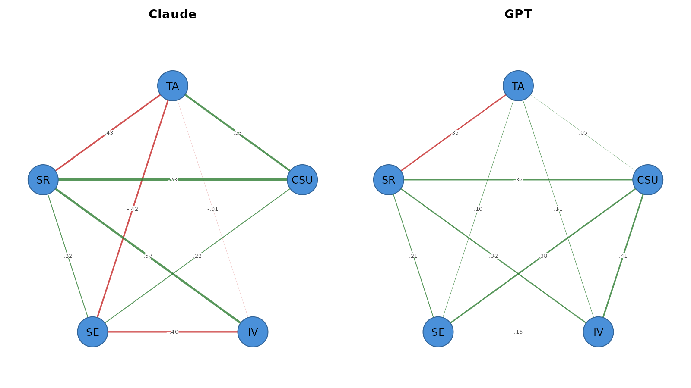

# Visualizing networks with cograph

`psychnets` belongs to the Dynalytics ecosystem: a framework for the
rigorous analytics of dynamical systems. Dynalytics treats estimation,
confirmatory testing, analysis, and software as parts of one scientific
contract: every analytical claim should be matched by evidence
appropriate to the structure and complexity of that claim. Within that
contract, `psychnets` covers psychological networks with clean-room,
base-R estimators, correctness certificates, tidy network objects, and
framework verbs for centrality, predictability, bootstrapping,
stability, and group comparison.

`cograph` is the visualization layer for this ecosystem. It is built for
fast, customizable network graphics across dynamical, social,
psychological, heterogeneous, and multilayer networks. A fitted
`psychnets` object can therefore move directly into `cograph` without
conversion: the same model can be rendered with different layouts,
themes, node shapes, centrality-scaled sizes, signed-edge colors,
thresholds, edge labels, group panels, and export settings. This
vignette shows that plotting workflow from the default graph to
publication-oriented figures.

## Fit Once

``` r

fit <- ebic_glasso(SRL_Claude)
fit
#> <psychnet> glasso network
#>   nodes: 5   edges: 10   (undirected)
#>   lambda: 0.009013   gamma: 0.5
#>   optimality (KKT residual): 3.92e-10
```

## Default cograph Plot

``` r

plot(fit)
```


The explicit `splot()` call is useful when you want to set plotting
parameters:

``` r

cograph::splot(fit)
```



## Layouts

The same network can be drawn with different layouts. Fixed seeds make
stochastic layouts reproducible.

``` r

op <- par(mfrow = c(1, 2), mar = c(1, 1, 3, 1))
cograph::splot(fit, layout = "circle", title = "circle")
cograph::splot(fit, layout = "spring", seed = 11, title = "spring")
```



``` r

par(op)
```

## Nodes and Labels

Node aesthetics can be set directly: fill, border, label size, and
shape. Scaling node size by a centrality measure makes the structural
role of each node visible.

``` r

cograph::splot(
  fit,
  layout = "circle",
  scale_nodes_by = "strength",
  node_size_range = c(4, 12),
  node_fill = c("#4C78A8", "#F58518", "#54A24B", "#B279A2", "#E45756"),
  node_border_color = "white",
  node_border_width = 2,
  label_size = 0.9,
  title = "Node size scaled by strength"
)
```



## Edges

For signed psychometric networks, edge color and width usually matter
more than decorative node styling. Thresholding and edge labels help
when the complete network is too dense.

``` r

cograph::splot(
  fit,
  layout = "circle",
  threshold = 0.05,
  edge_width_range = c(0.5, 5),
  edge_positive_color = "#2A9D8F",
  edge_negative_color = "#E76F51",
  edge_labels = TRUE,
  edge_label_size = 0.7,
  edge_label_bg = "white",
  title = "Thresholded edge weights"
)
```



The edge-weight distribution can be inspected separately:

``` r

cograph::plot_edge_weights(fit)
```



## Bootstrap and Edge Differences

Bootstrap diagnostics are estimated by `psychnets`. The default plot
shows edge-weight confidence intervals.

``` r

set.seed(1)
bs <- net_boot(SRL_Claude, method = "glasso", n_boot = 250, cores = 1)
plot(bs)
```



The same bootstrap object also contains the retained draws used for
pairwise edge-difference tests.

``` r

plot(bs, type = "edge_diff")
```


Use the forest style when the effect sizes and confidence intervals
matter more than the significance-box display.

``` r

plot(difference_test(bs, type = "edge"), style = "forest")
```



## Themes

Themes apply coordinated defaults without changing the fitted model.

``` r

op <- par(mfrow = c(1, 2), mar = c(1, 1, 3, 1))
cograph::splot(fit, theme = "minimal", title = "minimal")
cograph::splot(fit, theme = "colorblind", title = "colorblind")
```



``` r

par(op)
```

## Group Networks

`psychnet(..., group = )` returns a collection of fitted networks.
`cograph` plots the collection as a shared-layout grid, so node
positions are comparable across groups.

``` r

group_fit <- psychnet(grouped_srl, group = "source", method = "glasso")
cograph::splot(group_fit, layout = "circle", psych_styling = TRUE)
```



## Export

Use `filename`, `width`, `height`, and `res` when a figure is ready to
save:

``` r

cograph::splot(fit, layout = "circle", filename = "network.png",
               width = 8, height = 8, res = 300)
```

## Useful `splot()` Options

| Task | Arguments |
|----|----|
| Layout | `layout`, `seed`, `layout_scale`, `layout_margin` |
| Nodes | `node_size`, `scale_nodes_by`, `node_size_range`, `node_fill`, `node_shape` |
| Labels | `labels`, `label_size`, `label_color`, `label_position` |
| Edges | `edge_width_range`, `edge_positive_color`, `edge_negative_color`, `edge_alpha` |
| Filtering | `threshold`, `minimum`, `maximum` |
| Edge labels | `edge_labels`, `edge_label_size`, `edge_label_bg`, `edge_label_style` |
| Themes | `theme`, `background`, `title` |
| Export | `filename`, `width`, `height`, `res` |
